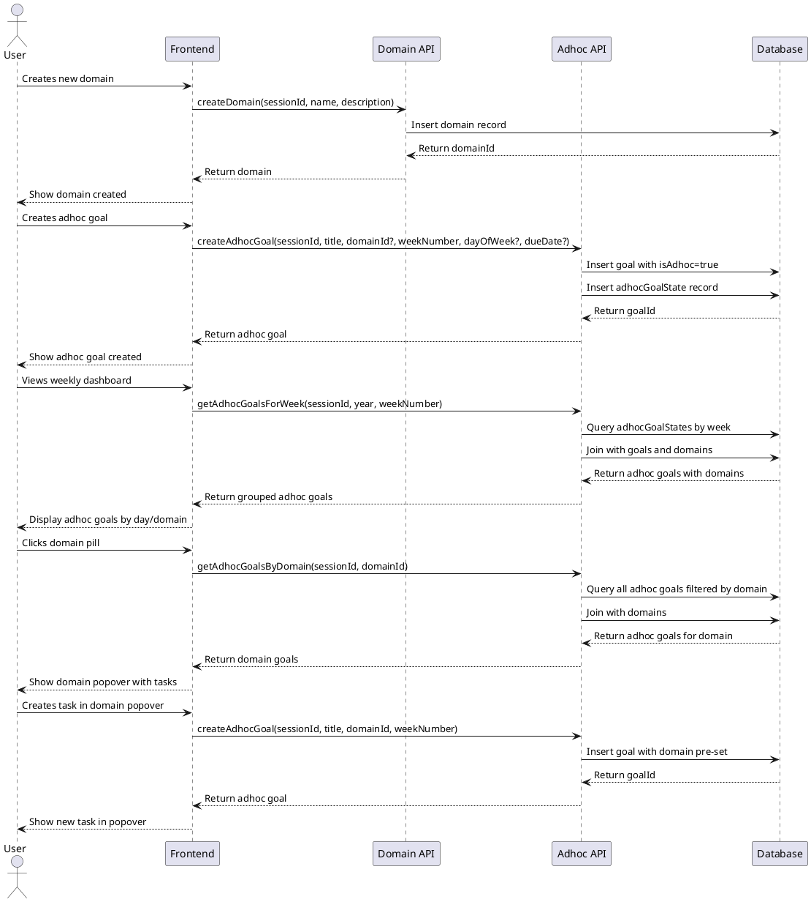

# Adhoc Goals with Domains - Codemap

## Description

Implements adhoc goals functionality with domain-based categorization. Adhoc goals are standalone tasks that don't fit into the quarterly/weekly/daily goal hierarchy but need to be tracked and completed. Domains provide categorization for organizing these tasks (e.g., "Home Maintenance", "Work Admin", "Personal Errands").

## Sequence Diagram



## Frontend Files

### Pages

- `apps/webapp/src/app/app/adhoc-goals/page.tsx` - Dedicated adhoc goals management page

### Components

#### Organisms

- `apps/webapp/src/components/organisms/AdhocGoalList.tsx` - List view for adhoc goals with filtering by domain and completion status
- `apps/webapp/src/components/organisms/focus/AdhocGoalsSection.tsx` - Section for displaying adhoc goals in focus mode (daily/weekly views)

#### Molecules

- `apps/webapp/src/components/molecules/AdhocGoalItem.tsx` - Individual adhoc goal display with completion checkbox and actions
- `apps/webapp/src/components/molecules/AdhocGoalForm.tsx` - Create/edit adhoc goal form with domain selection, week/day assignment, and due date
- `apps/webapp/src/components/molecules/DomainPopover.tsx` - Popover component that displays all adhoc tasks for a domain and allows creating new tasks with domain pre-set

#### Atoms

- `apps/webapp/src/components/atoms/DomainBadge.tsx` - Domain display badge with color and dark mode support
- `apps/webapp/src/components/atoms/DomainSelector.tsx` - Domain selection dropdown with inline domain creation dialog

### Hooks

- `apps/webapp/src/hooks/useDomains.tsx` - Domain management operations (CRUD with loading states)
- `apps/webapp/src/hooks/useAdhocGoals.tsx` - Adhoc goal CRUD operations

### Integration Points

- `apps/webapp/src/components/organisms/focus/FocusModeDailyViewDailyGoals.tsx` - Integrated adhoc goals into daily view
- Future: Weekly and quarterly views can integrate AdhocGoalsSection component

## Backend Files

### Schema Extensions

- `services/backend/convex/schema.ts` - Added domains table, adhocGoalStates table, and extended goals table with adhoc field

### Domain Management

- `services/backend/convex/domain.ts` - Domain CRUD operations with validation and duplicate checking
  - `createDomain` - Create new domain with name, description, and color
  - `updateDomain` - Update domain properties with ownership verification
  - `deleteDomain` - Delete domain with check for goals using it
  - `getDomains` - Get all domains for user (sorted by creation date)
  - `getDomain` - Get specific domain by ID

### Adhoc Goal Operations

- `services/backend/convex/adhocGoal.ts` - Adhoc goal CRUD operations
  - `createAdhocGoal` - Create adhoc goal with domain, week, day, and due date
  - `updateAdhocGoal` - Update adhoc goal properties and completion status
  - `deleteAdhocGoal` - Delete adhoc goal and its state records
  - `getAdhocGoalsForWeek` - Query adhoc goals for specific week with domain info
  - `getAdhocGoalsForDay` - Query adhoc goals for specific day with domain info
  - `getAllAdhocGoals` - Get all adhoc goals for user with domain info
  - `getAdhocGoalsByDomain` - Query adhoc goals filtered by domain (null for uncategorized)

### Utilities

- `services/backend/src/util/isoWeek.ts` - ISO week number utilities using Luxon
  - `getISOWeekNumber` - Get ISO week number from date
  - `getISOWeekYear` - Get ISO week year (may differ from calendar year)
  - `getISOWeekStart` - Get Monday timestamp for a week
  - `getISOWeekEnd` - Get Sunday timestamp for a week
  - `getISOWeeksInYear` - Get all ISO week numbers for a year
  - `isDateInISOWeek` - Check if date falls in specific ISO week
  - `getCurrentISOWeek` - Get current week year and number

## Contracts

### Domain Types

```typescript
// Domain data structure
export interface Domain {
  _id: Id<'domains'>;
  userId: Id<'users'>;
  name: string;
  description?: string;
  color?: string;
  createdAt: number; // Unix timestamp
}

// Domain creation input
export interface CreateDomainArgs {
  sessionId: Id<'sessions'>;
  name: string;
  description?: string;
  color?: string;
}

// Domain update input
export interface UpdateDomainArgs {
  sessionId: Id<'sessions'>;
  domainId: Id<'domains'>;
  name?: string;
  description?: string;
  color?: string;
}
```

### Adhoc Goal Types

```typescript
// Adhoc goal data structure (extends Goal)
// Goals with adhoc field are adhoc goals
export interface Goal {
  _id: Id<'goals'>;
  userId: Id<'users'>;
  year: number;
  quarter: number;
  title: string;
  details?: string;
  inPath: string;
  depth: number; // -1 for adhoc goals
  isComplete: boolean;
  completedAt?: number;

  // Adhoc-specific fields (optional object)
  adhoc?: {
    domainId?: Id<'domains'>; // undefined = "Uncategorized"
    weekNumber: number; // ISO week number (1-52)
    dayOfWeek?: DayOfWeek; // Optional day assignment
    dueDate?: number; // Optional specific due date (Unix timestamp)
  };
}

// Adhoc goal state for weekly tracking
export interface AdhocGoalState {
  _id: Id<'adhocGoalStates'>;
  userId: Id<'users'>;
  goalId: Id<'goals'>;
  year: number;
  weekNumber: number; // ISO week number
  dayOfWeek?: DayOfWeek;
  isComplete: boolean;
  completedAt?: number;
}

// Adhoc goal creation input
export interface CreateAdhocGoalArgs {
  sessionId: Id<'sessions'>;
  title: string;
  details?: string;
  domainId?: Id<'domains'>;
  weekNumber: number; // ISO week number
  dayOfWeek?: DayOfWeek;
  dueDate?: number;
}

// Adhoc goal update input
export interface UpdateAdhocGoalArgs {
  sessionId: Id<'sessions'>;
  goalId: Id<'goals'>;
  title?: string;
  details?: string;
  domainId?: Id<'domains'>;
  dayOfWeek?: DayOfWeek;
  dueDate?: number;
  isComplete?: boolean;
}
```

### API Function Interfaces

```typescript
// Domain management functions
export function createDomain(args: CreateDomainArgs): Promise<Id<'domains'>>;
export function updateDomain(args: UpdateDomainArgs): Promise<void>;
export function deleteDomain(args: {
  sessionId: Id<'sessions'>;
  domainId: Id<'domains'>;
}): Promise<void>;
export function getDomains(args: {
  sessionId: Id<'sessions'>;
}): Promise<Domain[]>;

// Adhoc goal management functions
export function createAdhocGoal(
  args: CreateAdhocGoalArgs
): Promise<Id<'goals'>>;
export function updateAdhocGoal(args: UpdateAdhocGoalArgs): Promise<void>;
export function deleteAdhocGoal(args: {
  sessionId: Id<'sessions'>;
  goalId: Id<'goals'>;
}): Promise<void>;
export function getAdhocGoalsForWeek(args: {
  sessionId: Id<'sessions'>;
  year: number;
  weekNumber: number;
}): Promise<AdhocGoal[]>;
export function getAdhocGoalsForDay(args: {
  sessionId: Id<'sessions'>;
  year: number;
  weekNumber: number;
  dayOfWeek: DayOfWeek;
}): Promise<AdhocGoal[]>;
export function getAdhocGoalsByDomain(args: {
  sessionId: Id<'sessions'>;
  domainId: Id<'domains'> | null; // null for uncategorized
}): Promise<AdhocGoal[]>;
```

### Frontend Handler Types

```typescript
// Domain handlers
export type DomainCreateHandler = (
  name: string,
  description?: string,
  color?: string
) => Promise<void>;
export type DomainUpdateHandler = (
  domainId: Id<'domains'>,
  updates: Partial<Domain>
) => Promise<void>;
export type DomainDeleteHandler = (domainId: Id<'domains'>) => Promise<void>;

// Adhoc goal handlers
export type AdhocGoalCreateHandler = (
  title: string,
  details?: string,
  domainId?: Id<'domains'>,
  weekNumber?: number,
  dayOfWeek?: DayOfWeek,
  dueDate?: number
) => Promise<void>;
export type AdhocGoalUpdateHandler = (
  goalId: Id<'goals'>,
  updates: Partial<AdhocGoal>
) => Promise<void>;
export type AdhocGoalDeleteHandler = (goalId: Id<'goals'>) => Promise<void>;
export type AdhocGoalToggleCompleteHandler = (
  goalId: Id<'goals'>,
  isComplete: boolean
) => Promise<void>;
```

### URL Parameters

No new URL parameters are required for this feature. All operations will be handled through existing session-based authentication and API calls.

### Database Schema Extensions

```typescript
// Add to existing schema.ts
domains: defineTable({
  userId: v.id('users'),
  name: v.string(),
  description: v.optional(v.string()),
  color: v.optional(v.string()), // Hex color code
  createdAt: v.number(), // Unix timestamp
})
.index('by_user', ['userId']),

adhocGoalStates: defineTable({
  userId: v.id('users'),
  goalId: v.id('goals'),
  year: v.number(),
  weekNumber: v.number(), // ISO week number
  dayOfWeek: v.optional(v.union(
    v.literal(DayOfWeek.MONDAY),
    v.literal(DayOfWeek.TUESDAY),
    v.literal(DayOfWeek.WEDNESDAY),
    v.literal(DayOfWeek.THURSDAY),
    v.literal(DayOfWeek.FRIDAY),
    v.literal(DayOfWeek.SATURDAY),
    v.literal(DayOfWeek.SUNDAY)
  )),
  isComplete: v.boolean(),
  completedAt: v.optional(v.number()),
})
.index('by_user_and_year_and_week', ['userId', 'year', 'weekNumber'])
.index('by_user_and_goal', ['userId', 'goalId'])
.index('by_user_and_year_and_week_and_day', ['userId', 'year', 'weekNumber', 'dayOfWeek']),

// Extended goals table with adhoc field:
goals: defineTable({
  // ... existing fields ...

  // Adhoc goal fields - grouped into optional object
  adhoc: v.optional(
    v.object({
      domainId: v.optional(v.id('domains')),
      weekNumber: v.number(), // ISO week number (1-52)
      dayOfWeek: v.optional(v.union(/* DayOfWeek literals */)),
      dueDate: v.optional(v.number()), // Unix timestamp
    })
  ),
})
.index('by_user_and_adhoc', ['userId', 'adhoc'])
.index('by_user_and_adhoc_week', ['userId', 'adhoc.weekNumber'])
// ... existing indexes ...
```

## Key Design Decisions

### 1. Adhoc Goals as Goal Extension

Instead of creating a separate table, adhoc goals extend the existing `goals` table with an optional `adhoc` field. This allows:

- Reuse of existing goal infrastructure
- Consistent completion tracking
- Simpler queries and data model

### 2. Domain Organization

Domains are separate entities that can be reused across multiple adhoc goals:

- Users can create custom domains (e.g., "Home", "Work", "Personal")
- Each domain has a name, optional description, and color for visual distinction
- Goals without a domain are shown as "Uncategorized"

### 3. ISO Week Numbering

Uses ISO 8601 week numbering for consistency:

- Weeks start on Monday and end on Sunday
- Week 1 is the first week with a Thursday in the new year
- Luxon library handles edge cases (e.g., week 53, year boundaries)

### 4. Flexible Time Assignment

Adhoc goals support multiple time assignment patterns:

- Week-level: Assigned to a week without specific day
- Day-level: Assigned to specific day of week
- Date-level: Optional due date for precise deadlines
- All three can be used together for maximum flexibility

### 5. Dark Mode Support

All UI components use semantic Tailwind colors:

- `bg-background`, `text-foreground` for main content
- `bg-muted`, `text-muted-foreground` for secondary content
- `bg-card`, `border-border` for card components
- Brand colors include dark variants (e.g., `bg-blue-100 dark:bg-blue-950/20`)

### 6. Domain Popover Interaction

Domain pills in AdhocGoalsSection are clickable and open a popover showing:

- All adhoc tasks for that domain (across all weeks)
- Inline task creation with domain pre-set
- Tasks sorted by completion status (incomplete first) and creation time
- Popover uses ShadCN Popover component with proper positioning

## Future Enhancements

1. **Recurring Adhoc Goals**: Support for goals that repeat weekly/monthly
2. **Domain Analytics**: Track completion rates and time spent per domain
3. **Smart Scheduling**: AI-suggested time slots based on past completion patterns
4. **Domain Sharing**: Share domains across team members
5. **Bulk Operations**: Move multiple goals between weeks/domains at once
6. **Calendar Integration**: Sync adhoc goals with external calendars
