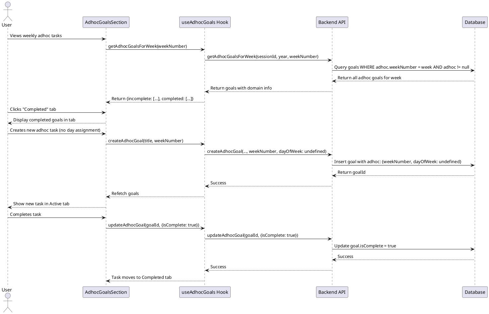

# Adhoc Tasks - Week Level with Completion Tabs

## Description

Refactors adhoc tasks to be week-level only (removing day-level assignment) and adds tabbed interface to separate incomplete and completed tasks. This prevents UI crowding and simplifies the adhoc task model while improving usability.

## Key Changes

1. **Deprecate `dayOfWeek` field**: Adhoc tasks are always week-level, never assigned to specific days
2. **Add completion tabs**: Separate UI tabs for "Active" (incomplete) and "Completed" tasks
3. **Fix pull operation**: Ensure adhoc tasks maintain correct week assignment when pulled
4. **Refactor for reusability**: Separate data fetching logic from rendering to enable tab reuse

## Sequence Diagram



## Frontend Files

### Components - Organisms

**Modified:**
- `apps/webapp/src/components/organisms/focus/AdhocGoalsSection.tsx`
  - Add tabs for Active/Completed tasks
  - Remove day-level filtering logic
  - Refactor rendering to extract reusable `AdhocGoalsList` component
  - Remove `dayOfWeek` parameter from component props
  - Update create flow to not pass `dayOfWeek`

### Components - Molecules

**New:**
- `apps/webapp/src/components/molecules/AdhocGoalsList.tsx`
  - Extracted rendering logic from `AdhocGoalsSection`
  - Accepts filtered goals and renders grouped by domain
  - Reused in both Active and Completed tabs
  - **Interface**:
    ```typescript
    interface AdhocGoalsListProps {
      goals: (Doc<'goals'> & { domain?: Doc<'domains'> })[];
      onCompleteChange: (goalId: Id<'goals'>, isComplete: boolean) => Promise<void>;
      onUpdate: (goalId: Id<'goals'>, title: string, details?: string, dueDate?: number, domainId?: Id<'domains'> | null) => Promise<void>;
      onDelete: (goalId: Id<'goals'>) => Promise<void>;
      showDueDate?: boolean;
      emptyMessage?: string;
    }
    ```

**Modified:**
- `apps/webapp/src/components/molecules/AdhocGoalItem.tsx`
  - No changes required (already doesn't show day of week in weekly view)

### Hooks

**Modified:**
- `apps/webapp/src/hooks/useAdhocGoals.tsx`
  - Update return type to separate incomplete and completed goals
  - **Modified Interface**:
    ```typescript
    interface UseAdhocGoalsReturn {
      adhocGoals: (Doc<'goals'> & { domain?: Doc<'domains'> })[];
      incompleteAdhocGoals: (Doc<'goals'> & { domain?: Doc<'domains'> })[]; // NEW
      completedAdhocGoals: (Doc<'goals'> & { domain?: Doc<'domains'> })[]; // NEW
      isLoading: boolean;
      createAdhocGoal: (
        title: string,
        details?: string,
        domainId?: Id<'domains'>,
        weekNumber?: number,
        dayOfWeek?: DayOfWeek, // DEPRECATED - will be ignored
        dueDate?: number
      ) => Promise<void>;
      updateAdhocGoal: (
        goalId: Id<'goals'>,
        updates: {
          title?: string;
          details?: string;
          domainId?: Id<'domains'> | null;
          dayOfWeek?: DayOfWeek; // DEPRECATED - will be ignored
          dueDate?: number;
          isComplete?: boolean;
        }
      ) => Promise<void>;
      deleteAdhocGoal: (goalId: Id<'goals'>) => Promise<void>;
    }
    ```

## Backend Files

### Schema

**Modified:**
- `services/backend/convex/schema.ts`
  - Mark `adhoc.dayOfWeek` as optional and deprecated
  - Add migration note in comments
  - **Schema Change**:
    ```typescript
    adhoc: v.optional(
      v.object({
        domainId: v.optional(v.id('domains')),
        weekNumber: v.number(), // ISO week number (1-53)
        dayOfWeek: v.optional(/* DayOfWeek union */), // DEPRECATED: Adhoc tasks are week-level only
        dueDate: v.optional(v.number()),
      })
    )
    ```

### Mutations

**Modified:**
- `services/backend/convex/adhocGoal.ts`
  - Update `createAdhocGoal` to ignore `dayOfWeek` parameter
  - Update `updateAdhocGoal` to ignore `dayOfWeek` in updates
  - Remove `dayOfWeek` from all adhoc goal state operations
  - **Modified Functions**:
    ```typescript
    export const createAdhocGoal = mutation({
      args: {
        sessionId: v.id('sessions'),
        title: v.string(),
        details: v.optional(v.string()),
        domainId: v.optional(v.id('domains')),
        weekNumber: v.number(),
        dayOfWeek: v.optional(/* DayOfWeek union */), // DEPRECATED - ignored
        dueDate: v.optional(v.number()),
      },
      handler: async (ctx, args): Promise<Id<'goals'>> => {
        // ... validation ...
        
        // Create adhoc goal WITHOUT dayOfWeek
        const goalId = await ctx.db.insert('goals', {
          // ... other fields ...
          adhoc: {
            domainId: args.domainId,
            weekNumber: args.weekNumber,
            // dayOfWeek: removed
            dueDate: args.dueDate,
          },
        });
        
        // Create state WITHOUT dayOfWeek
        await ctx.db.insert('adhocGoalStates', {
          userId,
          goalId,
          year,
          weekNumber: args.weekNumber,
          // dayOfWeek: removed
          isComplete: false,
        });
        
        return goalId;
      },
    });
    ```

- `services/backend/src/usecase/moveGoalsFromWeek/moveGoalsFromWeek.ts`
  - Update `moveAdhocGoals` to NOT update `dayOfWeek` (leave as-is or undefined)
  - **Modified Function**:
    ```typescript
    export async function moveAdhocGoals(
      ctx: MutationCtx,
      userId: Id<'users'>,
      adhocGoalsToMove: AdhocGoalToMove[],
      to: TimePeriod
    ): Promise<void> {
      await Promise.all(
        adhocGoalsToMove.map(async ({ goal }) => {
          if (!goal.adhoc) return;

          await ctx.db.patch(goal._id, {
            adhoc: {
              ...goal.adhoc,
              weekNumber: to.weekNumber, // Update week
              // dayOfWeek: leave unchanged or undefined
            },
          });

          // Update adhoc goal state
          const state = await ctx.db
            .query('adhocGoalStates')
            .withIndex('by_user_and_goal', (q) => q.eq('userId', userId).eq('goalId', goal._id))
            .first();

          if (state) {
            await ctx.db.patch(state._id, {
              year: to.year,
              weekNumber: to.weekNumber,
              // dayOfWeek: leave unchanged or undefined
            });
          }
        })
      );
    }
    ```

## Data Flow

### Viewing Adhoc Tasks

1. User navigates to weekly view
2. `AdhocGoalsSection` renders with `weekNumber` prop (no `dayOfWeek`)
3. Component fetches all adhoc goals for the week using `useAdhocGoals`
4. Hook separates goals into `incompleteAdhocGoals` and `completedAdhocGoals`
5. Component renders tabs:
   - **Active Tab**: Shows `incompleteAdhocGoals` using `<AdhocGoalsList />`
   - **Completed Tab**: Shows `completedAdhocGoals` using `<AdhocGoalsList />`
6. Each tab groups goals by domain and displays with domain badges

### Creating Adhoc Task

1. User types title and optionally selects domain
2. User presses Enter
3. Component calls `createAdhocGoal(title, undefined, domainId, weekNumber, undefined, undefined)`
4. Backend creates goal with `adhoc: { weekNumber, domainId }` (no `dayOfWeek`)
5. Backend creates state with `{ weekNumber }` (no `dayOfWeek`)
6. Query refresh updates UI, new task appears in Active tab

### Completing Adhoc Task

1. User clicks checkbox on task
2. Component calls `updateAdhocGoal(goalId, { isComplete: true })`
3. Backend updates `goal.isComplete = true`
4. Query refresh moves task from Active tab to Completed tab

### Pulling from Previous Week

1. User clicks "Pull from Previous Week"
2. Backend identifies incomplete adhoc goals from source week
3. Backend calls `moveAdhocGoals(ctx, userId, adhocGoals, targetWeek)`
4. For each adhoc goal:
   - Update `goal.adhoc.weekNumber` to target week
   - Update `adhocGoalState.weekNumber` to target week
   - Leave `dayOfWeek` as undefined (or existing value if present from old data)
5. Goals appear in target week's Active tab

## UI Changes

### Before (Current)

```
📋 Adhoc Tasks
  Home (2)
    ☐ Buy groceries [Monday]
    ☐ Fix sink [Tuesday]
  Work (3)
    ☐ Review PR [Wednesday]
    ☐ Update docs [No day assigned]
    ☐ Send email [Friday]
  [ Add adhoc task... ]
```

### After (New)

```
📋 Adhoc Tasks  [Active (5)] [Completed (3)]

  Active Tab:
    Home (2)
      ☐ Buy groceries
      ☐ Fix sink
    Work (3)
      ☐ Review PR  
      ☐ Update docs
      ☐ Send email
    [ Add adhoc task... ]

  Completed Tab:
    Home (1)
      ☑ Water plants
    Work (2)
      ☑ Submit timesheet
      ☑ Book meeting room
```

## Business Rules

1. **MUST**: Adhoc tasks are always week-level, never day-level
2. **MUST**: Separate incomplete and completed tasks into different tabs
3. **MUST**: Default to showing Active tab on load
4. **MUST**: Show count of tasks in each tab label
5. **MUST**: When pulling from previous week, preserve week assignment (update to new week)
6. **MUST**: Ignore `dayOfWeek` parameter in all create/update operations
7. **SHOULD**: Show empty state message in Completed tab when no completed tasks
8. **SHOULD**: Extract rendering logic to avoid code duplication between tabs
9. **MAY**: Add option to archive/hide completed tasks in future

## Migration Strategy

### Phase 1: Deprecation (This PR)

1. Mark `dayOfWeek` as deprecated in schema comments
2. Update backend to ignore `dayOfWeek` in new creations
3. Update frontend to not pass `dayOfWeek` in create operations
4. Leave existing `dayOfWeek` values in database (backward compatibility)

### Phase 2: Data Cleanup (Future PR)

1. Create migration script to remove `dayOfWeek` from all adhoc goals
2. Remove `dayOfWeek` from schema entirely
3. Remove deprecated parameters from function signatures

## Testing Checklist

- [ ] Create new adhoc task - appears in Active tab, no day assignment
- [ ] Complete adhoc task - moves from Active to Completed tab
- [ ] Incomplete completed task - moves from Completed to Active tab
- [ ] Pull from previous week - adhoc tasks move to new week
- [ ] Tab counts update correctly when tasks change state
- [ ] Empty state shows in Completed tab when no completed tasks
- [ ] Domain grouping works in both tabs
- [ ] Dark mode colors work correctly in tabs
- [ ] Existing adhoc tasks with `dayOfWeek` still display (backward compat)

## Implementation Order

1. Create `AdhocGoalsList` component (extracted rendering logic)
2. Update `useAdhocGoals` hook to separate incomplete/completed
3. Add tabs to `AdhocGoalsSection` using extracted component
4. Update `createAdhocGoal` backend to ignore `dayOfWeek`
5. Update `moveAdhocGoals` to preserve (not update) `dayOfWeek`
6. Remove `dayOfWeek` prop from `AdhocGoalsSection` usage sites
7. Test all flows
8. Update codemap with actual implementation

