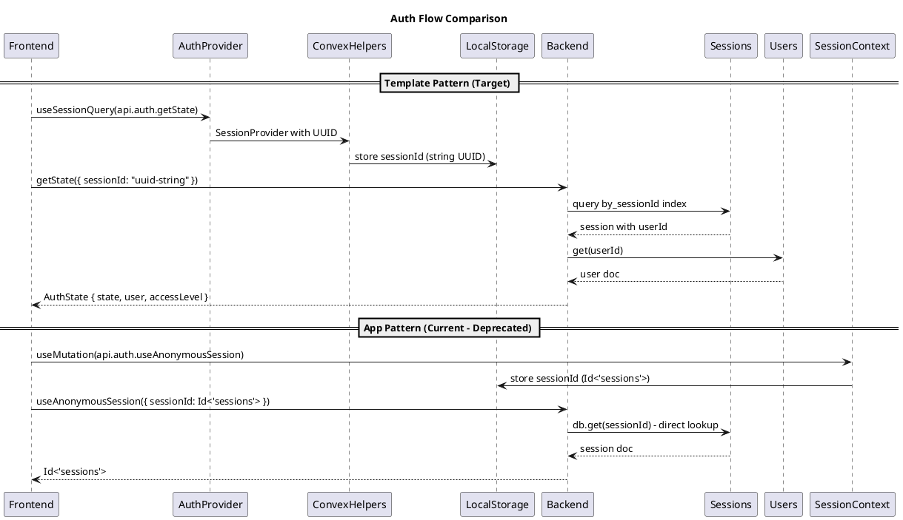

# Auth Template Alignment Codemap

## Title

Authentication System Alignment with Upstream Template

## Description

This codemap documents the differences between the app's current authentication implementation and the upstream template's approach, and provides a migration path to align with template conventions. The goal is to standardize on the template's session management pattern while maintaining backward compatibility during the transition.

## Key Differences Summary

| Aspect | App (Current) | Template (Target) |
|--------|--------------|-------------------|
| Session ID | `Id<'sessions'>` (document _id) | String UUID in `sessions.sessionId` field |
| Session lookup | Direct `ctx.db.get(sessionId)` | Index query on `by_sessionId` |
| Auth state hook | `SessionContext` with mutation | `AuthProvider` with convex-helpers |
| User name field | `displayName` (anonymous users) | `name` |
| Session creation | `useAnonymousSession` returns `_id` | `loginAnon` uses client-provided sessionId |

## Sequence Diagram



## Frontend Files

### Template Auth (Target Pattern)

- `apps/webapp/src/modules/auth/AuthProvider.tsx` - Main auth provider using convex-helpers SessionProvider
  - **Functions**:
    ```typescript
    AuthProvider: React.FC<{ children: React.ReactNode }>
    useAuthState(): AuthState | undefined
    useCurrentUser(): Doc<'users'> | undefined
    ```

- `apps/webapp/src/modules/auth/RequireLogin.tsx` - Auth guard component
  - **Functions**:
    ```typescript
    RequireLogin: React.FC<{ children: React.ReactNode }>
    ```

- `apps/webapp/src/modules/auth/AnonymousLoginButton.tsx` - Anonymous login trigger
- `apps/webapp/src/modules/auth/GoogleLoginButton.tsx` - Google OAuth trigger
- `apps/webapp/src/modules/auth/LoginCodeGenerator.tsx` - Cross-device login code generation
- `apps/webapp/src/modules/auth/LoginWithCode.tsx` - Login with code verification
- `apps/webapp/src/modules/auth/ConnectButton.tsx` - Account linking component
- `apps/webapp/src/modules/auth/useGoogleLoginFlow.ts` - Google OAuth hook
- `apps/webapp/src/modules/auth/useSession.tsx` - Session management hook

### App Auth (Deprecated - To Be Migrated)

- `apps/webapp/src/modules/auth/SessionContext.tsx` - **DEPRECATED**: Old session management
  - Uses `api.auth.useAnonymousSession` which returns `Id<'sessions'>`
  - Stores `Id<'sessions'>` in localStorage
  - **Migration**: Replace usages with `AuthProvider` pattern

## Backend Files

### Template Auth Functions (Target Pattern)

- `services/backend/convex/auth.ts` - Main auth functions
  - **Functions**:
    ```typescript
    getState(args: { sessionId: string }): Promise<AuthState>
    loginAnon(args: { sessionId: string }): Promise<{ success: boolean; userId: Id<'users'> }>
    logout(args: { sessionId: string }): Promise<{ success: boolean }>
    updateUserName(args: { sessionId: string; newName: string }): Promise<{ success: boolean; ... }>
    getActiveLoginCode(args: { sessionId: string }): Promise<{ success: boolean; code?: string; ... }>
    generateLoginCode(args: { sessionId: string }): Promise<{ success: boolean; code?: string; ... }>
    verifyLoginCode(args: { sessionId: string; code: string }): Promise<{ success: boolean; ... }>
    generateRecoveryCode(args: { sessionId: string }): Promise<{ success: boolean; code?: string; ... }>
    verifyRecoveryCode(args: { code: string; sessionId: string }): Promise<{ success: boolean; ... }>
    disconnectProvider(args: { sessionId: string; providerId: string }): Promise<{ success: boolean; ... }>
    ```

### Backward Compatibility Functions (To Be Deprecated)

- `services/backend/convex/auth.ts` - Backward compat section
  - **Functions** (DEPRECATED):
    ```typescript
    // @deprecated - Use loginAnon with client-provided sessionId instead
    useAnonymousSession(args: { sessionId?: Id<'sessions'> | string | null }): Promise<Id<'sessions'>>
    
    // @deprecated - Use getState instead
    getUser(args: { sessionId: Id<'sessions'> }): Promise<Doc<'users'> | null>
    ```

### Auth Modules

- `services/backend/modules/auth/accessControl.ts` - Access level utilities
  - **Functions**:
    ```typescript
    getAccessLevel(user: Doc<'users'>): AccessLevel
    isSystemAdmin(user: Doc<'users'>): boolean
    ```

- `services/backend/modules/auth/codeUtils.ts` - Login code utilities
  - **Functions**:
    ```typescript
    generateLoginCode(): string
    getCodeExpirationTime(): number
    isCodeExpired(expiresAt: number): boolean
    ```

- `services/backend/modules/auth/getAuthUser.ts` - User retrieval utility
- `services/backend/modules/auth/types/AuthState.ts` - Auth state type definitions

## Contracts

```typescript
// From services/backend/modules/auth/types/AuthState.ts
export type AuthState =
  | {
      sessionId: string;
      state: 'unauthenticated';
      reason: string;
    }
  | {
      sessionId: string;
      state: 'authenticated';
      user: Doc<'users'>;
      accessLevel: AccessLevel;
      isSystemAdmin: boolean;
      authMethod?: 'google' | 'login_code' | 'recovery_code' | 'anonymous' | 'username_password';
    };

// From services/backend/modules/auth/accessControl.ts
export type AccessLevel = 'user' | 'system_admin';

// From services/backend/convex/schema.ts - User types
type UserDoc = 
  | { type: 'full'; name: string; email: string; username?: string; recoveryCode?: string; accessLevel?: AccessLevel; google?: GoogleProfile }
  | { type: 'anonymous'; name?: string; displayName?: string; recoveryCode?: string; accessLevel?: AccessLevel }
  | { type: 'user'; name: string; displayName: string; email: string; recoveryCode?: string; accessLevel?: AccessLevel };

// From services/backend/convex/schema.ts - Session type
interface SessionDoc {
  sessionId?: string;          // Template pattern - client-provided UUID
  userId: Id<'users'>;
  createdAt?: number;
  status?: 'active';           // App pattern (deprecated)
  lastActiveAt?: number;       // App pattern (deprecated)
  authMethod?: 'google' | 'login_code' | 'recovery_code' | 'anonymous' | 'username_password';
  expiresAt?: number;          // DEPRECATED
  expiresAtLabel?: string;     // DEPRECATED
}
```

## Schema

```typescript
// From services/backend/convex/schema.ts

// Users table with union types for different auth methods
users: defineTable(
  v.union(
    // Template full user type
    v.object({
      type: v.literal('full'),
      name: v.string(),
      username: v.optional(v.string()),
      email: v.string(),
      recoveryCode: v.optional(v.string()),
      accessLevel: v.optional(v.union(v.literal('user'), v.literal('system_admin'))),
      google: v.optional(v.object({ /* Google profile */ })),
    }),
    // Template anonymous user type (with displayName for backward compat)
    v.object({
      type: v.literal('anonymous'),
      name: v.optional(v.string()),
      displayName: v.optional(v.string()), // DEPRECATED - migrate to name
      recoveryCode: v.optional(v.string()),
      accessLevel: v.optional(v.union(v.literal('user'), v.literal('system_admin'))),
    }),
    // App user type (for existing app data compatibility)
    v.object({
      type: v.literal('user'),
      email: v.string(),
      name: v.string(),
      displayName: v.string(),
      recoveryCode: v.optional(v.string()),
      accessLevel: v.optional(v.union(v.literal('user'), v.literal('system_admin'))),
    })
  )
)
  .index('by_username', ['username'])
  .index('by_email', ['email'])
  .index('by_name', ['name'])
  .index('by_googleId', ['google.id']),

// Sessions table
sessions: defineTable({
  sessionId: v.optional(v.string()),  // Template pattern - client UUID
  userId: v.id('users'),
  createdAt: v.optional(v.number()),
  status: v.optional(v.literal('active')),    // DEPRECATED
  lastActiveAt: v.optional(v.number()),       // DEPRECATED
  authMethod: v.optional(v.union(/* auth methods */)),
  expiresAt: v.optional(v.number()),          // DEPRECATED
  expiresAtLabel: v.optional(v.string()),     // DEPRECATED
}).index('by_sessionId', ['sessionId']),
```

## Migration Plan

### Phase 1: Data Migration (Run via Convex Dashboard)

1. **Run user name normalization** (already created):
   ```
   internal.migration.normalizeAnonymousUserNames
   ```
   - Copies `displayName` to `name` for anonymous users

2. **Run user name cleanup**:
   ```
   internal.migration.removeAnonymousUserDisplayName
   ```
   - Removes `displayName` field after migration

3. **Create new migration: Populate sessionId field for existing sessions**:
   - For sessions without `sessionId` string, generate UUID and populate
   - This allows existing sessions to work with template pattern

### Phase 2: Code Changes (After Data Migration)

1. **Remove SessionContext.tsx usage**:
   - Files using `SessionContext`:
     - Search for: `import { SessionContext }` or `useContext(SessionContext)`
   - Replace with: `useAuthState()` from `AuthProvider`

2. **Remove useAnonymousSession calls**:
   - Files calling `api.auth.useAnonymousSession`:
     - `apps/webapp/src/modules/auth/SessionContext.tsx`
   - Replace with: `useSessionMutation(api.auth.loginAnon)`

3. **Remove getUser calls**:
   - Files calling `api.auth.getUser`:
     - `services/backend/convex/goal.ts` (line 638)
   - Replace with: `requireLogin(ctx, sessionId)` from usecase

4. **Update schema**:
   - Remove `displayName` from anonymous user type
   - Make `name` required for anonymous users
   - Remove deprecated session fields: `status`, `lastActiveAt`, `expiresAt`, `expiresAtLabel`

### Phase 3: Cleanup (After Code Changes Verified)

1. **Remove backward compatibility functions from auth.ts**:
   - `useAnonymousSession`
   - `getUser`

2. **Delete SessionContext.tsx**

3. **Remove migration functions from migration.ts**:
   - `normalizeAnonymousUserNames`
   - `removeAnonymousUserDisplayName`

## Files Requiring Changes

### High Priority (Breaking Changes)

| File | Change Required |
|------|-----------------|
| `services/backend/convex/schema.ts` | Remove deprecated user/session fields after migration |
| `services/backend/convex/auth.ts` | Remove backward compat functions after migration |
| `apps/webapp/src/modules/auth/SessionContext.tsx` | DELETE after migration |

### Medium Priority (Code Updates)

| File | Change Required |
|------|-----------------|
| `services/backend/convex/goal.ts:638` | Replace `api.auth.getUser` with `requireLogin` |
| `apps/webapp/src/modules/profile/NameEditForm.tsx` | Remove displayName fallbacks |
| `apps/webapp/src/modules/attendance/components/Attendance.tsx` | Remove displayName fallbacks |

### Low Priority (Cleanup)

| File | Change Required |
|------|-----------------|
| `services/backend/convex/migration.ts` | Remove user migration functions after complete |

