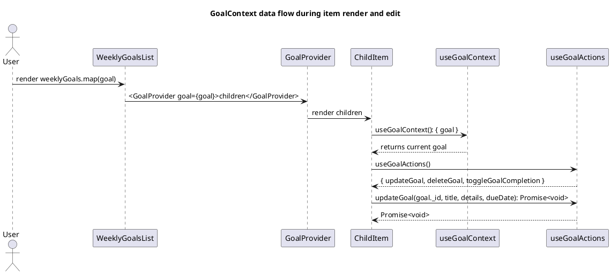

## Title

GoalContext Migration Plan

## Description

Introduce a GoalContext to eliminate prop drilling of goal data and handlers across the UI. The context will provide the current goal object and related helpers to any component within its subtree. We will wrap goal-rendering list items with GoalProvider to make goal data accessible to all nested components that currently receive `goal` or `goalId` via props.

## Sequence Diagram



## Frontend Files

MUST migrate all components that currently accept/pass `goal` or `goalId` props to instead consume `useGoalContext()` where applicable. Grouped by area:

- Components - Focus/Daily/Weekly

  - `apps/webapp/src/components/organisms/focus/FocusModeDailyViewDailyGoals.tsx`
  - `apps/webapp/src/components/organisms/focus/FocusModeDailyView.tsx`
  - `apps/webapp/src/components/organisms/WeekCardDailyGoals.tsx`
  - `apps/webapp/src/components/organisms/WeekCardWeeklyGoals.tsx`
  - `apps/webapp/src/components/organisms/WeekCardQuarterlyGoals.tsx`
  - `apps/webapp/src/components/organisms/DailyGoalList.tsx`
  - `apps/webapp/src/components/organisms/DailyGoalListContainer.tsx`
  - `apps/webapp/src/components/organisms/DailyGoalTaskItem.tsx`
  - `apps/webapp/src/components/organisms/DailyGoalGroup.tsx`
  - `apps/webapp/src/components/organisms/QuarterlyGoal.tsx`
  - `apps/webapp/src/components/organisms/WeekCardPreviewDialog.tsx`
  - `apps/webapp/src/components/organisms/GoalDeletePreviewDialog.tsx`
  - `apps/webapp/src/components/organisms/DeleteGoalIconButton.tsx`

- Molecules - Day of Week

  - `apps/webapp/src/components/molecules/day-of-week/containers/DayContainer.tsx`
  - `apps/webapp/src/components/molecules/day-of-week/components/WeeklyGoalTaskItem.tsx`
  - `apps/webapp/src/components/molecules/day-of-week/components/QuarterlyGoalHeader.tsx`

- Molecules - Goal Details

  - `apps/webapp/src/components/molecules/goal-details/GoalDetailsFullScreenModal.tsx`
  - `apps/webapp/src/components/molecules/goal-details/GoalDetailsPopover.tsx`
  - `apps/webapp/src/components/molecules/goal-details/GoalDetailsChildrenList.tsx`
  - `apps/webapp/src/components/molecules/goal-details/GoalActionMenu.tsx`
  - `apps/webapp/src/components/molecules/goal-details/PendingStatusDialog.tsx`
  - `apps/webapp/src/components/molecules/goal-details/MoveGoalToWeekModal.tsx`

- Molecules - Quarterly Summary

  - `apps/webapp/src/components/molecules/quarterly-summary/WeeklySummarySection.tsx`
  - `apps/webapp/src/components/molecules/quarterly-summary/DailySummaryItem.tsx`
  - `apps/webapp/src/components/molecules/quarterly-summary/WeeklyTaskItem.tsx`
  - `apps/webapp/src/components/molecules/quarterly-summary/WeekSection.tsx`
  - `apps/webapp/src/components/molecules/quarterly-summary/QuarterlyGoalSummaryView.tsx`
  - `apps/webapp/src/components/molecules/quarterly-summary/MultiQuarterlySummaryMarkdownView.tsx`
  - `apps/webapp/src/components/molecules/quarterly-summary/QuarterlyGoalSelector.tsx`

- Atoms

  - `apps/webapp/src/components/atoms/GoalEditPopover.tsx`
  - `apps/webapp/src/components/atoms/GoalSelector.tsx`
  - `apps/webapp/src/components/atoms/FireIcon.tsx`
  - `apps/webapp/src/components/atoms/PendingIcon.tsx`

- Routes

  - `apps/webapp/src/app/app/goal/[goalId]/quarterly-summary/page.tsx`

- Hooks/Contexts to verify integration (no direct migration to GoalContext, but must adjust usage)
  - `apps/webapp/src/hooks/useSummaryGoalActions.tsx`
  - `apps/webapp/src/hooks/useGoalActions.tsx`
  - `apps/webapp/src/hooks/useMoveWeeklyGoal.tsx`
  - `apps/webapp/src/hooks/useWeek.tsx`
  - `apps/webapp/src/contexts/GoalActionsContext.tsx`
  - `apps/webapp/src/contexts/GoalStatusContext.tsx`
  - `apps/webapp/src/components/molecules/goal-details/GoalEditContext.tsx`

## Backend Files

None. This migration is purely frontend. No Convex schema or endpoints change required.

## Contracts

- Documentation-only proposed context API (new):

```ts
// New: apps/webapp/src/contexts/GoalContext.tsx
export interface GoalContextValue {
  goal: GoalWithDetailsAndChildren;
}

export function GoalProvider({
  goal,
  children,
}: {
  goal: GoalWithDetailsAndChildren;
  children: React.ReactNode;
}): JSX.Element;
export function useGoalContext(): GoalContextValue;
```

- Existing types referenced:

```ts
// From services/backend/src/usecase/getWeekDetails
// type GoalWithDetailsAndChildren = { _id: Id<'goals'>; title: string; details?: string; dueDate?: number; parentId?: Id<'goals'>; depth: 0|1|2; isComplete: boolean; children: GoalWithDetailsAndChildren[]; state?: { isStarred?: boolean; isPinned?: boolean } }

// From apps/webapp/src/models/goal-handlers.ts
export type GoalUpdateHandler = (
  goalId: Id<"goals">,
  title: string,
  details?: string,
  dueDate?: number
) => Promise<void>;

export type GoalDeleteHandler = (goalId: Id<"goals">) => Promise<void>;
```

## URL Parameters

No new URL parameters. Existing `goalId` route usage remains unchanged.

## Migration Plan

1. Create GoalContext

   - Add `apps/webapp/src/contexts/GoalContext.tsx` with `GoalProvider` and `useGoalContext` hook.

2. Wrap list renders where goal objects are mapped

   - For each list that renders goals (daily/weekly/quarterly), wrap each item:
     - Example: `{goals.map(goal => (<GoalProvider goal={goal}><Child /></GoalProvider>))}`

3. Replace prop drilling with context in consumers

   - In files listed above, remove `goal`/`goalId` props where the value is already provided by `GoalProvider` and access via `useGoalContext()`.

4. Preserve external boundaries

   - Public components that are used outside goal-rendering contexts may keep `goal` prop temporarily; internally prefer `useGoalContext()` when provider is present.

5. Validate
   - Typecheck, run existing tests, verify in light/dark modes.

## Phasing

- Phase A (Low-risk, high-impact):

  - Daily/Weekly task item components and goal-details molecules:
    - `DailyGoalTaskItem.tsx`, `WeeklyGoalTaskItem.tsx`, `GoalDetailsPopover.tsx`, `GoalDetailsFullScreenModal.tsx`, `GoalActionMenu.tsx`, `GoalDetailsChildrenList.tsx`.

- Phase B:

  - Organisms that orchestrate lists: `WeekCardDailyGoals.tsx`, `WeekCardWeeklyGoals.tsx`, `FocusModeDailyViewDailyGoals.tsx`, `QuarterlyGoal.tsx`, `DayContainer.tsx`.

- Phase C:
  - Quarterly summary set and ancillary atoms using `goalId` icons.

## Rationale

- Reduces optional prop drilling and centralizes goal data access.
- Localized providers keep render scope small and avoid global state churn.
- Compatible with existing `GoalActionsContext` and `GoalStatusContext`.

## Risks and Mitigations

- Risk: Mixed usage during migration.

  - Mitigation: Components should support both prop and context during transition, with context taking precedence when available.

- Risk: Over-wrapping many providers could affect performance.
  - Mitigation: Providers are lightweight; memoize `goal` where necessary and keep providers at the item-level only.

## Acceptance Criteria

- ✅ No component should require drilling `goal` solely for descendant consumption.
- ✅ All files listed have either been wrapped with `GoalProvider` or updated to use `useGoalContext()` where appropriate.
- ✅ All deprecated `goal` props have been removed from component interfaces.
- ✅ All backward compatibility code has been cleaned up.

## Migration Status

### ✅ Phase A: Complete

- Created `GoalContext` and provider
- Migrated leaf components (atoms/molecules)
- All components now use context

### ✅ Phase B: Complete

- Migrated organism components
- Updated list renderers to wrap items with `GoalProvider`

### ✅ Phase C: Complete

- Migrated remaining components
- All quarterly summary components updated

### ✅ Cleanup: Complete

- Removed all deprecated `goal` props
- Removed backward compatibility fallbacks
- Cleaned up unused imports
- All components now enforce context-only pattern

## Reflection and Future Work

### Is this a good change?

✅ **Yes!** The migration successfully:

- Eliminated prop drilling of `goal` objects through multiple component layers
- Centralized goal data access at exact render boundaries
- Keeps providers local (per item), minimizing global re-renders
- Aligns with existing `GoalActionsContext` and `GoalStatusContext` patterns
- Simplified component interfaces by removing drilling props

### What was accomplished?

- **16 files migrated** across 3 phases
- **All deprecated props removed** - no more backward compatibility code
- **Consistent patterns** - all goal-related components use the same context approach
- **Cleaner interfaces** - components have simpler, focused prop interfaces

### What fragmentation remains?

- Multiple contexts: `GoalContext` (data), `GoalActionsContext` (mutations), and `GoalStatusContext` (fire/pending) can feel scattered. Coalescing these into a single scope could simplify mental overhead, at the cost of a larger context value.
- Boundary components: top-level orchestrators still pass goal collections and wrap providers; that's expected and acceptable.

### Future Work (optional)

- **Consolidate scope**: introduce a `GoalScopeProvider` that composes `GoalContext`, `GoalActionsContext`, and `GoalStatusContext` for item subtrees, exposing a single hook `useGoalScope()` with `{ goal, actions, status }`.
- **Selector-based context**: if re-render hot paths appear, adopt selector patterns (e.g., `useContextSelector`) or split contexts by concern fields to reduce unnecessary renders.
- **ESLint rule**: add a custom lint rule to enforce context usage and prevent accidental prop drilling.
- **Testing**: add unit tests for `GoalProvider` to ensure proper context provision.
- **Docs**: add a guide explaining when to wrap with `GoalProvider` vs. pass explicit props (rare cases: cross-goal comparisons, list-level algorithms).
