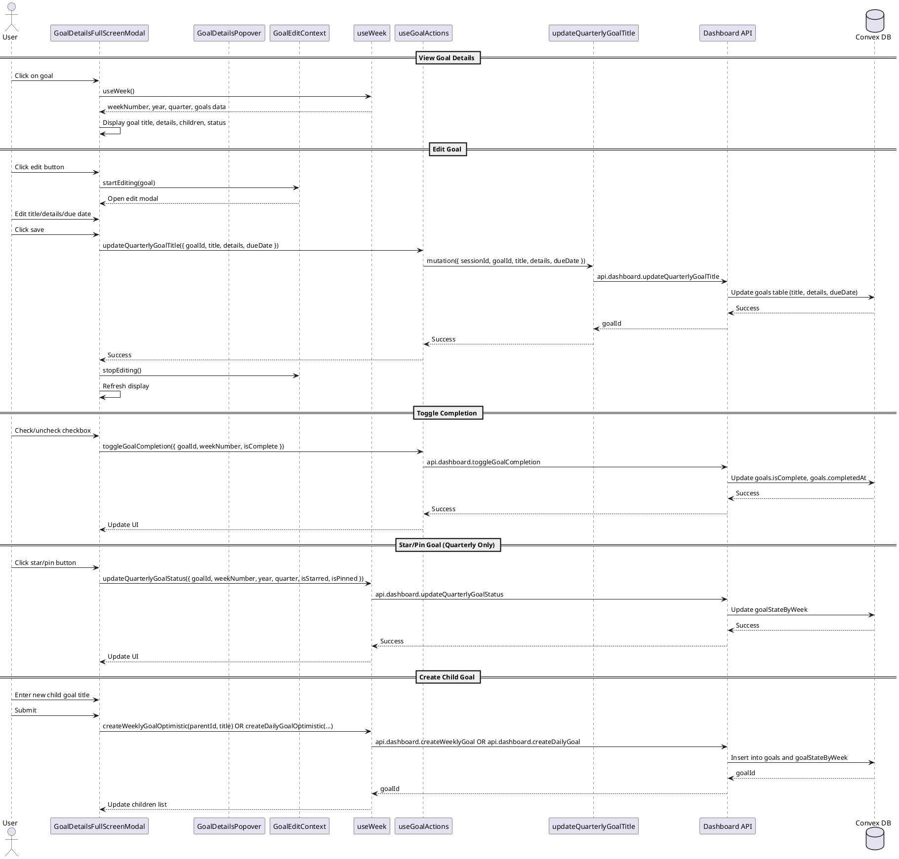

# Goal Details Modal Codemap

## Title

Goal Details Modal and Editing Flow

## Description

This codemap documents the flow for viewing and editing goal details through two modal interfaces: a full-screen modal and a popover. Users can view goal information, edit title, details, and due date, toggle completion status, manage child goals, and interact with goal-specific features like starring/pinning (for quarterly goals). This flow supports all goal types: quarterly (depth 0), weekly (depth 1), and daily (depth 2).

**Recent Implementation**: Due date functionality has been added to all goals. Users can now view and set due dates in the goal details modal, with visual indicators for overdue and upcoming deadlines.

## Sequence Diagram



## Frontend Entry Point / Route

The goal details modal is not a route-based component. It is invoked from various locations throughout the application wherever goals are displayed.

**Primary Usage Locations:**

- Week view components (quarterly, weekly, daily goal lists)
- Focus view components
- Quarterly summary view

## Frontend Components

### Modal Components

- `apps/webapp/src/components/molecules/goal-details/GoalDetailsFullScreenModal.tsx` - Full-screen modal for viewing and editing goal details
- `apps/webapp/src/components/molecules/goal-details/GoalDetailsPopover.tsx` - Popover version for compact goal details display
- `apps/webapp/src/components/molecules/goal-details/GoalEditContext.tsx` - Context provider for managing edit state
- `apps/webapp/src/components/molecules/goal-details/GoalDetailsContent.tsx` - Displays goal details (rich text) with expandable full view
- `apps/webapp/src/components/molecules/goal-details/GoalDetailsChildrenList.tsx` - Lists child goals within the modal
- `apps/webapp/src/components/molecules/goal-details/GoalActionMenu.tsx` - Action menu for goal operations (edit, delete, move, etc.)

### Supporting Components

- `apps/webapp/src/components/ui/dialog.tsx` - Base dialog component from ShadCN
- `apps/webapp/src/components/ui/popover.tsx` - Base popover component from ShadCN
- `apps/webapp/src/components/ui/rich-text-editor.tsx` - Rich text editor for goal details
- `apps/webapp/src/components/ui/input.tsx` - Input component for title editing
- `apps/webapp/src/components/ui/checkbox.tsx` - Checkbox for completion toggle
- `apps/webapp/src/components/ui/button.tsx` - Button components
- `apps/webapp/src/components/ui/calendar.tsx` - Calendar component for due date selection (ShadCN)
- `apps/webapp/src/components/atoms/CreateGoalInput.tsx` - Input for creating child goals
- `apps/webapp/src/components/atoms/GoalStarPin.tsx` - Star/Pin toggle component

## Frontend Service Layer

### Hooks

- `apps/webapp/src/hooks/useWeek.tsx` - Primary data hook for week-based goal management

  - **Functions**:
    ```typescript
    useWeek(): {
      weekNumber: number;
      year: number;
      quarter: number;
      quarterlyGoals: GoalWithDetailsAndChildren[];
      createQuarterlyGoal: (params: CreateQuarterlyGoalParams) => Promise<Id<'goals'>>;
      createWeeklyGoalOptimistic: (parentId: Id<'goals'>, title: string) => Promise<void>;
      createDailyGoalOptimistic: (parentId: Id<'goals'>, title: string, dayOfWeek: DayOfWeek, dateTimestamp: number) => Promise<void>;
      updateQuarterlyGoalStatus: (params: UpdateQuarterlyGoalStatusParams) => Promise<void>;
      updateQuarterlyGoalTitle: (params: { goalId: Id<'goals'>, title: string, details?: string, dueDate?: number }) => Promise<void>;
      toggleGoalCompletion: (params: ToggleGoalCompletionParams) => Promise<void>;
      deleteGoalOptimistic: (goalId: Id<'goals'>) => Promise<void>;
    }
    ```

- `apps/webapp/src/hooks/useGoalActions.tsx` - Lower-level hook providing goal mutation actions

  - **Functions**:
    ```typescript
    useGoalActions(): {
      createQuarterlyGoal: (params: CreateQuarterlyGoalParams) => Promise<Id<'goals'>>;
      createWeeklyGoal: (params: CreateWeeklyGoalParams) => Promise<Id<'goals'>>;
      createDailyGoal: (params: CreateDailyGoalParams) => Promise<Id<'goals'>>;
      updateQuarterlyGoalStatus: (params: UpdateQuarterlyGoalStatusParams) => Promise<void>;
      updateQuarterlyGoalTitle: (params: { goalId: Id<'goals'>, title: string, details?: string, dueDate?: number }) => Promise<void>;
      deleteGoal: (params: { goalId: Id<'goals'> }) => Promise<void>;
      toggleGoalCompletion: (params: ToggleGoalCompletionParams) => Promise<void>;
    }
    ```

- `apps/webapp/src/hooks/useSummaryGoalActions.tsx` - Hook for goal actions in summary views
  - **Functions**:
    ```typescript
    useSummaryGoalActions(props?: { onDataRefresh?: () => void }): {
      handleToggleComplete: (goal: GoalWithDetailsAndChildren, weekNumber: number) => Promise<void>;
      handleEditGoal: (goalId: Id<'goals'>, title: string, details?: string, dueDate?: number) => Promise<void>;
      handleDeleteGoal: (goalId: Id<'goals'>) => Promise<void>;
      isLoading: boolean;
    }
    ```

### Types

From `services/backend/src/usecase/getWeekDetails.ts`:

```typescript
// From services/backend/src/usecase/getWeekDetails.ts
type Goal = Doc<"goals">;

type GoalWithDetails = Goal & {
  grandParentTitle?: string;
  parentTitle?: string;
  state?: Doc<"goalStateByWeek">;
};

export type GoalWithDetailsAndChildren = TWithChildren<GoalWithDetails>;

export type TWithChildren<T> = T & {
  path: string;
  children: TWithChildren<T>[];
};
```

## Backend Function Entry Point

### Dashboard Operations

- `services/backend/convex/dashboard.ts` - Main backend file for dashboard and goal operations

  - **Functions**:

    ```typescript
    export const createQuarterlyGoal = mutation({
      args: {
        sessionId: v.id("sessions"),
        year: v.number(),
        quarter: v.number(),
        title: v.string(),
        details: v.optional(v.string()),
        weekNumber: v.number(),
        isPinned: v.optional(v.boolean()),
        isStarred: v.optional(v.boolean()),
      },
      handler: async (ctx, args): Promise<Id<"goals">> => {
        /* ... */
      },
    });

    export const updateQuarterlyGoalStatus = mutation({
      args: {
        sessionId: v.id("sessions"),
        year: v.number(),
        quarter: v.number(),
        weekNumber: v.number(),
        goalId: v.id("goals"),
        isStarred: v.boolean(),
        isPinned: v.boolean(),
      },
      handler: async (ctx, args): Promise<void> => {
        /* ... */
      },
    });

    export const updateGoalTitle = mutation({
      args: {
        sessionId: v.id("sessions"),
        goalId: v.id("goals"),
        title: v.string(),
        details: v.optional(v.string()),
      },
      handler: async (ctx, args): Promise<Id<"goals">> => {
        /* ... */
      },
    });

    export const createWeeklyGoal = mutation({
      args: {
        sessionId: v.id("sessions"),
        title: v.string(),
        details: v.optional(v.string()),
        parentId: v.id("goals"),
        weekNumber: v.number(),
      },
      handler: async (ctx, args): Promise<Id<"goals">> => {
        /* ... */
      },
    });

    export const createDailyGoal = mutation({
      args: {
        sessionId: v.id("sessions"),
        title: v.string(),
        details: v.optional(v.string()),
        parentId: v.id("goals"),
        weekNumber: v.number(),
        dayOfWeek: v.union(/* day literals */),
        dateTimestamp: v.optional(v.number()),
      },
      handler: async (ctx, args): Promise<Id<"goals">> => {
        /* ... */
      },
    });

    export const toggleGoalCompletion = mutation({
      args: {
        sessionId: v.id("sessions"),
        goalId: v.id("goals"),
        weekNumber: v.number(),
        isComplete: v.boolean(),
        updateChildren: v.optional(v.boolean()),
      },
      handler: async (ctx, args): Promise<void> => {
        /* ... */
      },
    });
    ```

### Goal Operations

- `services/backend/convex/goal.ts` - Additional goal operations (delete, move, etc.)
  - **Functions**:
    ```typescript
    export const deleteGoal = mutation({
      args: {
        sessionId: v.id("sessions"),
        goalId: v.id("goals"),
      },
      handler: async (ctx, args): Promise<void> => {
        /* ... */
      },
    });
    ```

### Contracts

```typescript
// From services/backend/convex/schema.ts
interface GoalDoc {
  // Partition
  userId: Id<"users">;
  year: number;
  quarter: number;

  // Data
  title: string;
  details?: string;
  parentId?: Id<"goals">;
  inPath: string;
  depth: number; // 0 for quarterly, 1 for weekly, 2 for daily
  carryOver?: {
    type: "week";
    numWeeks: number;
    fromGoal: {
      previousGoalId: Id<"goals">;
      rootGoalId: Id<"goals">;
    };
  };
  isComplete: boolean;
  completedAt?: number; // Unix timestamp
}

interface GoalStateByWeekDoc {
  // Partition
  userId: Id<"users">;
  year: number;
  quarter: number;

  // State tracking
  goalId: Id<"goals">;
  weekNumber: number;

  // Quarterly goal state
  isStarred: boolean;
  isPinned: boolean;

  // Daily goal state
  daily?: {
    dayOfWeek: DayOfWeek;
    dateTimestamp?: number;
  };

  carryOver?: {
    type: "week";
    numWeeks: number;
    fromGoal: {
      previousGoalId: Id<"goals">;
      rootGoalId: Id<"goals">;
    };
  };
}

// API mutation parameters
interface CreateQuarterlyGoalArgs {
  sessionId: Id<"sessions">;
  year: number;
  quarter: number;
  title: string;
  details?: string;
  weekNumber: number;
  isPinned?: boolean;
  isStarred?: boolean;
}

interface UpdateGoalTitleArgs {
  sessionId: Id<"sessions">;
  goalId: Id<"goals">;
  title: string;
  details?: string;
  dueDate?: number; // Unix timestamp
}

interface UpdateQuarterlyGoalStatusArgs {
  sessionId: Id<"sessions">;
  year: number;
  quarter: number;
  weekNumber: number;
  goalId: Id<"goals">;
  isStarred: boolean;
  isPinned: boolean;
}

interface ToggleGoalCompletionArgs {
  sessionId: Id<"sessions">;
  goalId: Id<"goals">;
  weekNumber: number;
  isComplete: boolean;
  updateChildren?: boolean;
}
```

## Backend Usecase Layer

- `services/backend/src/usecase/getWeekDetails.ts` - Retrieves week goals tree structure

  - **Functions**:

    ```typescript
    export const getWeekGoalsTree = async (
      ctx: MutationCtx | QueryCtx,
      args: {
        userId: Id<'users'>;
        year: number;
        quarter: number;
        weekNumber: number;
      }
    ): Promise<WeekGoalsTree> => { /* ... */ }

    export function buildGoalTree(
      n: Goal[],
      attach: (n: GoalWithDetailsAndChildren) => GoalWithDetailsAndChildren
    ): {
      tree: GoalWithDetailsAndChildren[];
      index: Record<Id<'goals'>, GoalWithDetailsAndChildren>;
    } => { /* ... */ }
    ```

- `services/backend/src/usecase/requireLogin.ts` - Validates user session
  - **Functions**:
    ```typescript
    export const requireLogin = async (
      ctx: MutationCtx | QueryCtx,
      sessionId: Id<"sessions">
    ): Promise<Doc<"users">> => {
      /* ... */
    };
    ```

## Backend Schema

- `services/backend/convex/schema.ts` - Database schema definitions

  - `goals` table definition

    - Fields: userId, year, quarter, title, details, parentId, inPath, depth, carryOver, isComplete, completedAt
    - Indexes:
      - `by_user_and_year_and_quarter`: [userId, year, quarter]
      - `by_user_and_year_and_quarter_and_parent`: [userId, year, quarter, parentId]

  - `goalStateByWeek` table definition
    - Fields: userId, year, quarter, goalId, weekNumber, isStarred, isPinned, daily, carryOver
    - Indexes:
      - `by_user_and_year_and_quarter_and_week`: [userId, year, quarter, weekNumber]
      - `by_user_and_goal`: [userId, goalId]
      - `by_user_and_goal_and_year_and_quarter_and_week`: [userId, goalId, year, quarter, weekNumber]

```typescript
// Schema Definition
goals: defineTable({
  //partition
  userId: v.id("users"),
  year: v.number(),
  quarter: v.number(),

  //data
  title: v.string(),
  details: v.optional(v.string()),
  dueDate: v.optional(v.number()), // Unix timestamp for due date
  parentId: v.optional(v.id("goals")),
  inPath: v.string(),
  depth: v.number(),
  carryOver: v.optional(carryOverSchema),
  isComplete: v.boolean(),
  completedAt: v.optional(v.number()),
})
  .index("by_user_and_year_and_quarter", ["userId", "year", "quarter"])
  .index("by_user_and_year_and_quarter_and_parent", [
    "userId",
    "year",
    "quarter",
    "parentId",
  ]);
```

---

## Implementation Notes: Due Date Feature

### Completed Implementation (✅)

The due date feature has been fully implemented across the stack. Below is a summary of the implementation.

#### Backend Schema (✅ Completed)

```typescript
goals: defineTable({
  //partition
  userId: v.id("users"),
  year: v.number(),
  quarter: v.number(),

  //data
  title: v.string(),
  details: v.optional(v.string()),
  dueDate: v.optional(v.number()), // NEW: Unix timestamp for due date
  parentId: v.optional(v.id("goals")),
  inPath: v.string(),
  depth: v.number(),
  carryOver: v.optional(carryOverSchema),
  isComplete: v.boolean(),
  completedAt: v.optional(v.number()),
});
```

#### Backend Mutations (✅ Completed)

All goal creation and update mutations now accept `dueDate`:

```typescript
// createQuarterlyGoal
export const createQuarterlyGoal = mutation({
  args: {
    sessionId: v.id("sessions"),
    year: v.number(),
    quarter: v.number(),
    title: v.string(),
    details: v.optional(v.string()),
    dueDate: v.optional(v.number()), // NEW
    weekNumber: v.number(),
    isPinned: v.optional(v.boolean()),
    isStarred: v.optional(v.boolean()),
  },
  handler: async (ctx, args): Promise<Id<"goals">> => {
    /* ... */
  },
});

// updateGoalTitle (rename to updateGoal)
export const updateGoal = mutation({
  args: {
    sessionId: v.id("sessions"),
    goalId: v.id("goals"),
    title: v.string(),
    details: v.optional(v.string()),
    dueDate: v.optional(v.number()), // NEW
  },
  handler: async (ctx, args): Promise<Id<"goals">> => {
    /* ... */
  },
});

// createWeeklyGoal and createDailyGoal have similar updates
```

**Mutations Updated**:

- `createQuarterlyGoal` - accepts `dueDate?: v.optional(v.number())`
- `updateQuarterlyGoalTitle` - accepts `dueDate?: v.optional(v.number())`
- `updateGoalTitle` - accepts `dueDate?: v.optional(v.number())`
- `createWeeklyGoal` - accepts `dueDate?: v.optional(v.number())`
- `createDailyGoal` - accepts `dueDate?: v.optional(v.number())`

#### Frontend Types (✅ Auto-generated)

`GoalDoc` type automatically includes `dueDate` from schema:

```typescript
// In services/backend/convex/schema.ts (reflected in generated types)
interface GoalDoc {
  // ... existing fields
  dueDate?: number; // NEW: Unix timestamp
}
```

#### Frontend Component Updates (✅ Completed)

**GoalDetailsFullScreenModal.tsx** - Updated with:

- Date picker using ShadCN `Calendar` component in a `Popover`
- Display of current due date with color-coding:
  - 🔴 Red for overdue goals (past due date, not complete)
  - 🟡 Yellow for upcoming goals (within 3 days, not complete)
  - Default for other states
- "Clear" button to remove due date
- State management with `editDueDate` (`Date | undefined`)
- Passes `dueDate?.getTime()` to save handler

**GoalDetailsPopover.tsx** - Updated with:

- Same date picker UI as full-screen modal
- Same color-coding and display logic
- Same state management and save behavior

**GoalEditContext.tsx** - No changes needed ✅

**Actual UI Implementation**:

```typescript
import { CalendarIcon } from "lucide-react";
import { DateTime } from "luxon";
import { Calendar } from "@/components/ui/calendar";
import {
  Popover,
  PopoverContent,
  PopoverTrigger,
} from "@/components/ui/popover";

// State management:
const [editDueDate, setEditDueDate] = useState<Date | undefined>(undefined);

// Initialize from goal:
useEffect(() => {
  if (isEditing && editingGoal) {
    setEditDueDate(
      editingGoal.dueDate ? new Date(editingGoal.dueDate) : undefined
    );
  }
}, [isEditing, editingGoal]);

// Edit form UI:
<div className="space-y-2">
  <label className="text-sm font-medium text-muted-foreground">Due Date</label>
  <Popover>
    <PopoverTrigger asChild>
      <Button
        variant="outline"
        className="w-full justify-start text-left font-normal"
      >
        <CalendarIcon className="mr-2 h-4 w-4" />
        {editDueDate
          ? DateTime.fromJSDate(editDueDate).toFormat("MMM dd, yyyy")
          : "No due date"}
      </Button>
    </PopoverTrigger>
    <PopoverContent className="w-auto p-0">
      <Calendar
        mode="single"
        selected={editDueDate}
        onSelect={setEditDueDate}
      />
      {editDueDate && (
        <Button variant="ghost" onClick={() => setEditDueDate(undefined)}>
          Clear
        </Button>
      )}
    </PopoverContent>
  </Popover>
</div>;

// Display in view mode (with color-coding):
{
  goal.dueDate && (
    <div
      className={cn("text-sm", getDueDateColor(goal.dueDate, goal.isComplete))}
    >
      Due: {DateTime.fromMillis(goal.dueDate).toFormat("MMM dd, yyyy")}
      {isOverdue && " (overdue)"}
    </div>
  );
}

// Save handler:
await onSave(trimmedTitle, editDetails, editDueDate?.getTime());
```

#### Hook Updates (✅ Completed)

All hooks have been updated to accept and pass `dueDate`:

**useGoalActions.tsx** - Updated:

```typescript
updateQuarterlyGoalTitle: async ({
  goalId,
  title,
  details,
  dueDate, // NEW
}: {
  goalId: Id<"goals">;
  title: string;
  details?: string;
  dueDate?: number; // NEW
}) => {
  await updateGoalTitleMutation({
    sessionId,
    goalId,
    title,
    details,
    dueDate, // NEW
  });
};
```

**useSummaryGoalActions.tsx** - Updated:

```typescript
const handleEditGoal = useCallback(
  async (
    goalId: Id<"goals">,
    title: string,
    details?: string,
    dueDate?: number
  ) => {
    await updateQuarterlyGoalTitle({
      goalId,
      title,
      details,
      dueDate, // NEW
    });
    // ...
  },
  [updateQuarterlyGoalTitle, onDataRefresh]
);
```

**All Parent Components** - Updated to pass `dueDate` parameter:

- `QuarterlyGoal.tsx` - `handleSaveTitle` accepts `dueDate?`
- `WeekCardQuarterlyGoals.tsx` - `handleUpdateTitle` accepts `dueDate?`
- `DailyGoalList.tsx` - All handlers and interfaces updated
- `DayContainer.tsx` - Interface updated
- `QuarterlyGoalHeader.tsx` - Handler updated
- `WeeklyGoalTaskItem.tsx` - Handler updated
- `DailyGoalGroup.tsx` - Interface updated
- `DailyGoalListContainer.tsx` - Interface updated
- `PendingGoalsSection.tsx` - Interface updated
- `OnFireGoalsSection.tsx` - Interface updated
- `WeeklyTaskItem.tsx` - Handler updated
- `WeeklySummarySection.tsx` - Handler updated
- `DailySummaryItem.tsx` - Handler updated

### Display Logic (✅ Implemented)

Implemented display logic:

- Shows "Due: [formatted date]" when `dueDate` is set
- Color coding based on urgency:
  - 🔴 Red (`text-red-600 dark:text-red-400`): Due date is past AND goal is not complete
  - 🟡 Yellow (`text-yellow-600 dark:text-yellow-400`): Due date within 3 days AND goal is not complete
  - Default: All other states (completed goals, future dates)
- Displays "(overdue)" text for overdue incomplete goals
- "Clear" button in date picker to remove due date

### Known Issues & Bug Fixes

#### Bug Fix (2025-10-13): Due Date Not Being Saved

**Issue**: Due date was correctly captured in `GoalDetailsPopover` but became `undefined` when reaching `useGoalActions`.

**Root Cause**: The callback chain had missing `dueDate` parameters. Parent component handlers (`handleSaveTitle`, `onUpdateTitle`, etc.) were not accepting or passing through the `dueDate` parameter.

**Fix**: Updated all function signatures in the callback chain (14 files total) to accept and forward the `dueDate?: number` parameter. This ensures the due date flows correctly from the modal → parent components → hooks → backend mutations.

**Files Fixed**:

- All component `onSave` handlers
- All component `onUpdateTitle` interfaces
- All hook interfaces (`SummaryGoalActions`, etc.)

### UI Components Used

- ✅ **Calendar**: ShadCN's Calendar component
- ✅ **Popover**: ShadCN's Popover component
- ✅ **Icons**: `CalendarIcon` from `lucide-react`
- ✅ **Date Library**: `luxon` for date formatting and comparison
