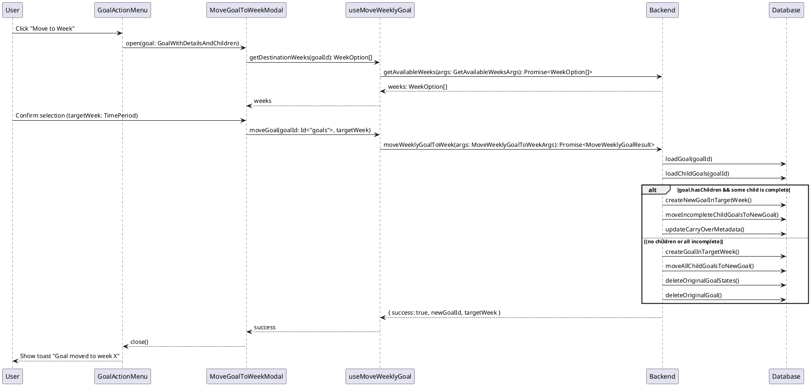

# Move Weekly Goal to Next Week Codemap

## Title

Move Weekly Goal to Selected Week

## Description

Enables users to move a weekly goal to any week within the current quarter from the goal details popover. The user launches a modal via the action menu, selects a destination week (defaulting to next week), and confirms. The backend supports moving weekly goals with or without child goals:

- If the weekly goal has no child daily goals, or if all child goals are incomplete, the entire weekly goal is moved to the selected week (original goal and states deleted).
- If the weekly goal has child goals and at least one is complete, the weekly goal remains in the original week, a copy is created in the destination week, and all incomplete child goals are re-parented to the new weekly goal (completed child goals stay in the original week).

Quarter and year boundaries are handled when listing valid destination weeks.

## Sequence Diagram



## Frontend Entry Point / Route

This feature is accessible from any view that displays weekly goals with the goal details popover:

- Quarterly view (`/app/dashboard?viewMode=quarterly`)
- Weekly view (`/app/dashboard?viewMode=weekly&week=X`)
- Daily view (`/app/dashboard?viewMode=daily&week=X&day=Y`)

No dedicated route - the action is available contextually in the GoalActionMenu component.

## Frontend Components

- `apps/webapp/src/components/molecules/goal-details/GoalActionMenu.tsx` - Dropdown menu in goal details popover that contains the "Move to Week" action
  - Shows "Move to Next Week" option only for weekly goals with no children
  - Triggers the move action via `useMoveWeeklyGoal` hook
- `apps/webapp/src/components/molecules/goal-details/GoalDetailsPopover.tsx` - Parent popover component that contains the action menu
- `apps/webapp/src/components/molecules/goal-details/MoveGoalToWeekModal.tsx` (NEW) - Modal shown when user selects "Move to Week"
  - Displays destination week dropdown (default pre-selected to next week)
  - Shows summary of move rules for child goals
  - Confirms action and invokes hook

## Frontend Service Layer

- `apps/webapp/src/hooks/useMoveWeeklyGoal.tsx` - Hook that encapsulates logic for moving a weekly goal to a specific week

  - **Functions**:
    ```typescript
    useMoveWeeklyGoal(year: number, quarter: number, currentWeekNumber: number): {
      getDestinationWeeks: () => WeekOption[];
      openMoveModal: (goal: GoalWithDetailsAndChildren) => void;
      moveGoalToWeek: (
        goal: GoalWithDetailsAndChildren,
        destination: { year: number; quarter: number; weekNumber: number }
      ) => Promise<void>;
      getMoveMode: (goal: GoalWithDetailsAndChildren) => "copy_children" | "move_all";
    };
    ```

- `apps/webapp/src/hooks/useWeek.tsx` - Provides current week, quarter, and year context
- `apps/webapp/src/hooks/useQuarterWeekInfo.tsx` - Provides quarter boundary information (start/end weeks)
- `apps/webapp/src/modules/auth/useSession.tsx` - Provides session ID for authentication

## Backend Function Entry Point

- `services/backend/convex/goal.ts` - Contains the `moveWeeklyGoalToWeek` mutation and helper query for available weeks
  - **Functions**:
    ```typescript
    getAvailableWeeks(args: GetAvailableWeeksArgs): Promise<WeekOption[]>;
    moveWeeklyGoalToWeek(args: MoveWeeklyGoalToWeekArgs): Promise<MoveWeeklyGoalResult>
    ```

### Contracts

```typescript
// From services/backend/src/usecase/moveGoalsFromWeek/types.ts
export type TimePeriod = {
  year: number;
  quarter: number;
  weekNumber: number;
  dayOfWeek?: DayOfWeek;
};

// From services/backend/convex/goal.ts
type MoveWeeklyGoalResult = {
  success: boolean;
  newGoalId: Id<"goals">;
  targetWeek: {
    year: number;
    quarter: number;
    weekNumber: number;
  };
};

export type WeekOption = {
  year: number;
  quarter: number;
  weekNumber: number;
  label: string;
};

export const getAvailableWeeks = query({
  args: {
    sessionId: v.id("sessions"),
    currentWeek: v.object({
      year: v.number(),
      quarter: v.number(),
      weekNumber: v.number(),
    }),
  },
  handler: async (ctx, args): Promise<WeekOption[]> => {
    // Returns all weeks of the current quarter starting from currentWeek
  },
});

export const moveWeeklyGoalToWeek = mutation({
  args: {
    sessionId: v.id("sessions"),
    goalId: v.id("goals"),
    currentWeek: v.object({
      year: v.number(),
      quarter: v.number(),
      weekNumber: v.number(),
    }),
    targetWeek: v.object({
      year: v.number(),
      quarter: v.number(),
      weekNumber: v.number(),
    }),
  },
  handler: async (ctx, args): Promise<MoveWeeklyGoalResult> => {
    // 1. Authenticate user
    // 2. Get goal and child goals
    // 3. Determine move mode (copy_children vs move_all)
    // 4. Ensure parent quarterly goal exists in target quarter if needed
    // 5. Create destination weekly goal (reuse or create new)
    // 6. Copy/move child goals based on move mode
    // 7. Delete or preserve original goal based on move mode
    // 8. Return success
  },
});

// Frontend Hook - apps/webapp/src/hooks/useMoveWeeklyGoal.tsx
export function useMoveWeeklyGoal(
  year: number,
  quarter: number,
  currentWeekNumber: number
): {
  moveToNextWeek: (goalId: Id<"goals">) => Promise<void>;
  canMoveToNextWeek: (goal: GoalWithDetailsAndChildren) => boolean;
  calculateNextWeek: (
    weekNumber: number,
    currentQuarter: number,
    currentYear: number
  ) => { year: number; quarter: number; weekNumber: number } | null;
};

// Component Props - apps/webapp/src/components/molecules/goal-details/GoalActionMenu.tsx
interface GoalActionMenuProps {
  goal: GoalWithDetailsAndChildren;
  onSave: (title: string, details?: string) => Promise<void>;
  isQuarterlyGoal?: boolean;
  className?: string;
}

// From services/backend/src/usecase/getWeekDetails.ts
export type GoalWithDetailsAndChildren = TWithChildren<GoalWithDetails>;
type GoalWithDetails = Goal & {
  grandParentTitle?: string;
  parentTitle?: string;
  state?: Doc<"goalStateByWeek">;
};
export type TWithChildren<T> = T & {
  path: string;
  children: TWithChildren<T>[];
};
```

## Backend Schema

- `services/backend/convex/schema.ts` - Schema definitions
  - `goals` table - Main goals table
    - **Relevant fields**: `userId`, `year`, `quarter`, `title`, `details`, `parentId`, `inPath`, `depth`, `isComplete`
    - **Indexes**:
      - `by_user_and_year_and_quarter` - For querying goals in a specific quarter
      - `by_user_and_year_and_quarter_and_parent` - For finding child goals
  - `goalStateByWeek` table - Weekly goal states
    - **Relevant fields**: `userId`, `year`, `quarter`, `goalId`, `weekNumber`, `isStarred`, `isPinned`
    - **Indexes**:
      - `by_user_and_goal_and_year_and_quarter_and_week` - For finding goal states

```typescript
// Schema Definition (simplified for this feature)
goals: defineTable({
  userId: v.id("users"),
  year: v.number(),
  quarter: v.number(),
  title: v.string(),
  details: v.optional(v.string()),
  parentId: v.optional(v.id("goals")),
  inPath: v.string(),
  depth: v.number(), // 0 = quarterly, 1 = weekly, 2 = daily
  isComplete: v.boolean(),
  completedAt: v.optional(v.number()),
})
  .index("by_user_and_year_and_quarter", ["userId", "year", "quarter"])
  .index("by_user_and_year_and_quarter_and_parent", [
    "userId",
    "year",
    "quarter",
    "parentId",
  ]);

goalStateByWeek: defineTable({
  userId: v.id("users"),
  year: v.number(),
  quarter: v.number(),
  goalId: v.id("goals"),
  weekNumber: v.number(),
  isStarred: v.boolean(),
  isPinned: v.boolean(),
}).index("by_user_and_goal_and_year_and_quarter_and_week", [
  "userId",
  "goalId",
  "year",
  "quarter",
  "weekNumber",
]);
```

## Utility Functions

- `services/backend/src/usecase/quarter/getQuarterWeeks.ts` - Calculate quarter week boundaries

  ```typescript
  getQuarterWeeks(year: number, quarter: number): {
    startWeek: number;
    endWeek: number;
    weeks: number[];
    startDate: DateTime;
    endDate: DateTime;
  }
  ```

- `services/backend/src/util/path.ts` - Path manipulation utilities
  ```typescript
  joinPath(...segments: string[]): string
  ```

## Data Flow

### Validation Flow

1. User opens goal details popover for a weekly goal (depth = 1)
2. GoalActionMenu checks if goal can be moved:
   - Goal must be depth 1 (weekly goal)
   - Goal must have no children (children.length === 0)
   - Must be able to calculate next week (not last week of Q4)
3. If conditions met, "Move to Next Week" option is shown

### Move Flow

1. User clicks "Move to Week" in GoalActionMenu (enabled for weekly goals regardless of child count)
2. Modal opens with destination week dropdown (default = next week)
3. Frontend hook fetches available weeks via `getAvailableWeeks`
4. User selects destination week and confirms
5. Frontend hook determines move mode:
   - `move_all` if weekly goal has no child goals or all children are incomplete
   - `copy_children` if goal has at least one completed child
6. Frontend calls backend mutation with `currentWeek`, `targetWeek`, and `goalId`
7. Backend authenticates and loads goal and children
8. Backend ensures parent quarterly goal exists in target quarter (create if necessary)
9. Backend branches based on move mode:
   - **move_all**:
     - Create new weekly goal in target week (copy fields, mark incomplete)
     - Move all child goals to target weekly goal
     - Delete original weekly goal states
     - Delete original weekly goal
   - **copy_children**:
     - Create new weekly goal in target week (copy fields, mark incomplete)
     - Move incomplete child goals to new weekly goal
     - Leave completed child goals and original weekly goal in place
10. Backend returns success payload with new goal ID and target week
11. Frontend shows success toast and closes modal
12. Convex query refresh updates UI (goal appears in new week as copy/move based on mode)

### Edge Cases

- **Quarter Boundary**: When moving from last week of quarter to first week of next quarter
  - If same year: Update quarter number, use first week of new quarter
  - If Q4 to Q1: Update year and quarter, use first week of Q1 next year
  - May need to handle parentId (quarterly goal may not exist in new quarter)
- **No Parent in Target Quarter**: If moving to a new quarter where the parent quarterly goal doesn't exist

  - Option 1: Prevent the move (show error)
  - Option 2: Create the goal without a parent (parentId = null, depth still = 1)
  - **Decision**: Use Option 2 for simplicity - weekly goal becomes standalone in new quarter

- **Year Boundary**: Moving from Q4 week 52/53 to Q1 week 1 of next year

  - Properly handle year increment
  - Reset quarter to 1

- **Daily Goal Day of Week Consolidation**: When moving a weekly goal with incomplete daily goals
  - **Problem**: Daily goals preserve their original day of week, which may be in the past relative to the destination week
  - **Solution**: Reset all moved daily goals to Monday (dayOfWeek = 1) in the destination week
  - **Rationale**: User can manually reassign days after move; defaulting to Monday is safer than preserving potentially stale day assignments

## Business Rules

1. **MUST**: Weekly goals can be moved regardless of child presence
2. **MUST**: Determine move mode based on child completion state
   - `move_all`: no child goals or all incomplete
   - `copy_children`: at least one completed child
3. **MUST**: Destination week defaults to next chronological week but can be any week in current quarter
4. **MUST**: Move respects quarter boundaries (only weeks within current quarter selectable)
5. **MUST**: New weekly goal in destination week is marked incomplete and created with same metadata
6. **MUST**: Child goals moved to destination week retain completion state
7. **MUST**: Completed child goals remain in original week when using `copy_children`
8. **MUST**: Original weekly goal deleted only in `move_all` mode
9. **MUST**: Moved daily goals have their day of week reset to Monday (dayOfWeek = 1)
10. **SHOULD**: Provide clear UI messaging about what happens to child goals
11. **SHOULD**: Show toast feedback on success or error

## UI Behavior

- Menu item only appears for weekly goals with no children
- Menu item disabled if cannot calculate next week (edge case)
- On success: Show toast "Goal moved to [Week X]"
- On error: Show error toast with specific message
- Popover closes after successful move
