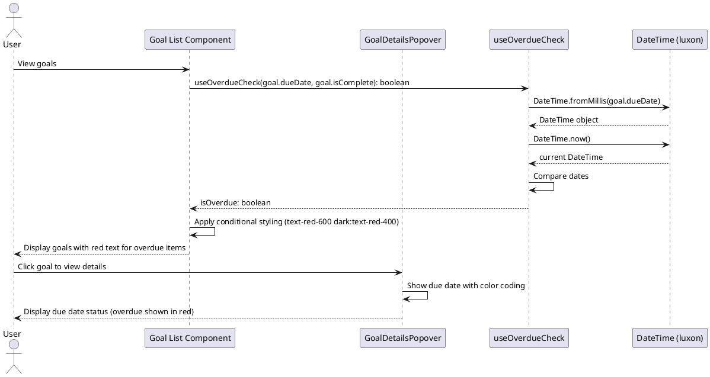

# Overdue Goals Styling Feature

## Description

This feature adds visual styling to goals based on due date urgency. Goals are color-coded to help users quickly identify items requiring attention:

1. **Red (Overdue)**: Goals past their due date and not completed - displayed in red
2. **Orange (Approaching - 2 days)**: Goals less than 2 days from due date and not completed - displayed in orange
3. **Yellow (Approaching - 3 days)**: Goals less than 3 days from due date and not completed - displayed in yellow

The styling is applied to goal titles throughout the application (week view, focus mode, summary views) and the due date tags in goal details modals/popovers.

## Sequence Diagram



## Frontend Files

### Utility Function (New)

- `apps/webapp/src/lib/date/getDueDateStyle.ts`
  - Utility function to determine styling class based on due date urgency
  - Parameters:
    - `dueDate?: number` - Unix timestamp of the due date
    - `isComplete: boolean` - Whether the goal is complete
  - Returns: `string` - CSS class string for text color styling
  - Implementation:
    ```typescript
    export function getDueDateStyle(
      dueDate: Date | null | undefined,
      completed: boolean,
      currentTime: Date = new Date()
    ): string {
      if (!dueDate || completed) {
        return '';
      }
      
      const dueDateOnly = new Date(dueDate.getFullYear(), dueDate.getMonth(), dueDate.getDate());
      const currentDateOnly = new Date(
        currentTime.getFullYear(),
        currentTime.getMonth(),
        currentTime.getDate()
      );
      
      const timeDiff = dueDateOnly.getTime() - currentDateOnly.getTime();
      const daysDiff = timeDiff / (1000 * 60 * 60 * 24);
      
      // Overdue: past due date (date-only comparison)
      if (daysDiff < 0) {
        return 'text-red-600 dark:text-red-400';
      }
      
      // Approaching: less than 2 days away
      if (daysDiff < 2) {
        return 'text-orange-600 dark:text-orange-400';
      }
      
      // Approaching: less than 3 days away
      if (daysDiff < 3) {
        return 'text-yellow-600 dark:text-yellow-400';
      }
      
      return '';
    }
    ```

### Goal List Item Components (Modified)

These components display individual goal items and need to apply red text styling when overdue:

#### 1. Quarterly Goals

- `apps/webapp/src/components/organisms/QuarterlyGoal.tsx`
  - Location: Line 84 (`GoalDetailsPopover` trigger)
  - Current: `triggerClassName="p-0 h-auto hover:bg-transparent font-normal justify-start text-left flex-1 focus-visible:ring-0 min-w-0 w-full"`
  - Update: Add `titleClassName` with conditional red styling
  - Changes:

    ```typescript
    const dueDateStyle = getDueDateStyle(goal.dueDate, goal.isComplete);

    <GoalDetailsPopover
      onSave={handleSaveGoal}
      triggerClassName="p-0 h-auto hover:bg-transparent font-normal justify-start text-left flex-1 focus-visible:ring-0 min-w-0 w-full"
      titleClassName={cn(
        "text-gray-600 flex items-center",
        dueDateStyle
      )}
      onToggleComplete={handleToggleCompletion}
    />;
    ```

#### 2. Weekly Goals

- `apps/webapp/src/components/molecules/day-of-week/components/WeeklyGoalTaskItem.tsx`
  - Location: Line 79 (`GoalDetailsPopover` trigger)
  - Current: `triggerClassName="p-0 h-auto hover:bg-transparent font-normal justify-start text-left flex-1 focus-visible:ring-0 min-w-0 w-full"`
  - Update: Add `titleClassName` with conditional red styling
  - Changes:

    ```typescript
    const dueDateStyle = getDueDateStyle(goal.dueDate, goal.isComplete);

    <GoalDetailsPopover
      onSave={_handleUpdateGoal}
      triggerClassName="p-0 h-auto hover:bg-transparent font-normal justify-start text-left flex-1 focus-visible:ring-0 min-w-0 w-full"
      titleClassName={cn(dueDateStyle)}
      onToggleComplete={_handleToggleCompletion}
    />;
    ```

#### 3. Daily Goals

- `apps/webapp/src/components/organisms/DailyGoalTaskItem.tsx`
  - Location: Line 86 (`GoalDetailsPopover` trigger)
  - Current: `triggerClassName="p-0 h-auto hover:bg-transparent font-normal justify-start text-left flex-1 focus-visible:ring-0 min-w-0 w-full"`
  - Update: Add `titleClassName` with conditional red styling
  - Changes:

    ```typescript
    const dueDateStyle = getDueDateStyle(goal.dueDate, goal.isComplete);

    <GoalDetailsPopover
      onSave={async (
        newTitle: string,
        newDetails?: string,
        dueDate?: number
      ) => {
        await onUpdateGoal(goal._id, newTitle, newDetails, dueDate);
      }}
      triggerClassName="p-0 h-auto hover:bg-transparent font-normal justify-start text-left flex-1 focus-visible:ring-0 min-w-0 w-full"
      titleClassName={cn(dueDateStyle)}
      onToggleComplete={async (checked) => {
        await toggleGoalCompletion({
          goalId: goal._id,
          weekNumber,
          isComplete: checked,
        });
        if (checked && isOnFire) {
          toggleFireStatus(goal._id);
        }
      }}
      additionalContent={/* ... */}
    />;
    ```

### Modal/Popover Components (Modified)

- `apps/webapp/src/components/molecules/goal-details/GoalDetailsPopover.tsx`
  - Location: Line 474-478 (trigger button)
  - Current implementation already accepts `titleClassName` prop
  - The prop is applied to the trigger button's span element (Line 475)
  - No changes needed - component already supports the feature
  
  - **Due Date Tag Update (Lines 370-388)**:
  - Updated to 3-tier color system with date-only comparison
  - Implementation:
    ```typescript
    DateTime.fromMillis(goal.dueDate).startOf('day') < DateTime.now().startOf('day') && !isComplete
      ? 'text-red-600 dark:text-red-400 font-medium'
      : DateTime.fromMillis(goal.dueDate).startOf('day') < DateTime.now().startOf('day').plus({ days: 2 }) && !isComplete
        ? 'text-orange-600 dark:text-orange-400 font-medium'
        : DateTime.fromMillis(goal.dueDate).startOf('day') < DateTime.now().startOf('day').plus({ days: 3 }) && !isComplete
          ? 'text-yellow-600 dark:text-yellow-400 font-medium'
          : 'text-muted-foreground'
    ```

- `apps/webapp/src/components/molecules/goal-details/GoalDetailsFullScreenModal.tsx`
  - Apply same 3-tier due date tag update with date-only comparison for consistency
  - Lines 409-418: Updated due date picker button styling

### Additional Components Potentially Affected

These components also display goals but may use different rendering patterns:

#### Summary Views

- `apps/webapp/src/components/molecules/quarterly-summary/WeeklyTaskItem.tsx`

  - Displays weekly goals in summary view
  - Location: Lines 105-112 (goal title heading)
  - Update: Add conditional styling to title
  - Changes:

    ```typescript
    const dueDateStyle = getDueDateStyle(
      weeklyGoal.dueDate,
      weeklyGoal.isComplete
    );

    <h4
      className={cn(
        "font-semibold text-base leading-tight mb-1",
        !disableStrikethrough &&
          isComplete &&
          "line-through text-muted-foreground",
        dueDateStyle
      )}
    >
      {weeklyGoal.title}
    </h4>;
    ```

- `apps/webapp/src/components/molecules/quarterly-summary/DailySummaryItem.tsx`

  - Displays daily goals in summary view
  - Location: Lines 114-121 (goal title heading)
  - Update: Add conditional styling to title
  - Changes:

    ```typescript
    const dueDateStyle = getDueDateStyle(dailyGoal.dueDate, dailyGoal.isComplete);

    <h4
      className={cn(
        "font-medium text-sm leading-tight mb-1",
        !disableStrikethrough &&
          isComplete &&
          "line-through text-muted-foreground",
        dueDateStyle
      )}
    >
      {dailyGoal.title}
    </h4>;
    ```

- `apps/webapp/src/components/molecules/quarterly-summary/MultiQuarterlyGoalSummaryView.tsx`
  - Displays quarterly goals in summary view
  - Location: Lines 111-118 (goal title heading)
  - Update: Add conditional styling to title
  - Changes:

    ```typescript
    const isOverdue = useOverdueCheck(
      quarterlyGoal.dueDate,
      quarterlyGoal.isComplete
    );

    <h2
      className={cn(
        "text-xl font-bold text-gray-900 mb-2 leading-tight",
        isComplete && "text-gray-500 line-through",
        isOverdue && !isComplete && "text-red-600 dark:text-red-400 font-medium"
      )}
    >
      {quarterlyGoal.title}
    </h2>;
    ```

#### Focus Mode Components

- `apps/webapp/src/components/organisms/focus/OnFireGoalsSection.tsx`

  - Displays on-fire goals in focus mode
  - Location: Line 236-240 (quarterly goal popover)
  - Already uses `GoalDetailsPopover` with `titleClassName`
  - Update: Add overdue check
  - Changes:

    ```typescript
    const isOverdue = useOverdueCheck(
      quarterlyGoal.dueDate,
      quarterlyGoal.isComplete
    );

    <GoalDetailsPopover
      onSave={(title, details, dueDate) =>
        _handleUpdateGoal(quarterlyGoal._id, title, details, dueDate)
      }
      triggerClassName="p-0 h-auto hover:bg-transparent font-semibold justify-start text-left flex-1 focus-visible:ring-0 min-w-0 w-full text-red-800 hover:text-red-900 hover:no-underline"
      titleClassName={cn(
        "break-words w-full whitespace-pre-wrap flex items-center",
        quarterlyGoal.isComplete ? "flex items-center" : "",
        isOverdue &&
          !quarterlyGoal.isComplete &&
          "text-red-600 dark:text-red-400 font-medium"
      )}
    />;
    ```

- `apps/webapp/src/components/organisms/focus/PendingGoalsSection.tsx`
  - Displays pending goals in focus mode
  - Uses similar patterns to OnFireGoalsSection
  - Update: Add overdue checks where goals are displayed

#### Week Card Components

- `apps/webapp/src/components/organisms/WeekCardQuarterlyGoals.tsx`

  - Displays quarterly goals in week cards
  - Uses `GoalDetailsPopover` with custom styling
  - Update: Add overdue check to title styling

- `apps/webapp/src/components/organisms/WeekCardWeeklyGoals.tsx`
  - Displays weekly goals in week cards
  - Location: Line 403-411 (quarterly goal popover)
  - Update: Add overdue check
  - Changes:

    ```typescript
    const isOverdue = useOverdueCheck(goal.dueDate, goal.isComplete);

    <GoalDetailsPopover
      onSave={async (title, details, dueDate) => {
        await handleUpdateWeeklyGoal(goal._id, title, details, dueDate);
      }}
      triggerClassName="p-0 h-auto hover:bg-transparent font-normal justify-start text-left flex-1 focus-visible:ring-0 min-w-0 w-full font-semibold"
      titleClassName={cn(
        isOverdue && !goal.isComplete && "text-red-600 dark:text-red-400"
      )}
      onToggleComplete={(newState) =>
        handleToggleQuarterlyCompletion(goal._id, newState)
      }
    />;
    ```

## Backend Files

No backend changes required. The feature uses existing `dueDate` field in the goals schema.

## Contracts

### Function Interface

```typescript
/**
 * Utility function to determine CSS classes for styling goal titles based on due date urgency
 * Uses date-only comparison (ignores time component)
 * @param dueDate - Date object of the due date (optional)
 * @param completed - Whether the goal is complete
 * @param currentTime - Current date for comparison (defaults to new Date())
 * @returns CSS class string for text color styling
 */
export function getDueDateStyle(
  dueDate: Date | null | undefined,
  completed: boolean,
  currentTime?: Date
): string;
```

### Styling Convention

The due date styling uses consistent Tailwind classes across all components:

- **Overdue**: `text-red-600 dark:text-red-400`
- **Approaching (<2 days)**: `text-orange-600 dark:text-orange-400`
- **Approaching (<3 days)**: `text-yellow-600 dark:text-yellow-400`
- **Default**: Empty string (uses component's default text color)

This styling is applied to:
1. Goal title text in all list views (via `titleClassName` prop)
2. Due date tag display in `GoalDetailsPopover.tsx` and `GoalDetailsFullScreenModal.tsx`

## Implementation Notes

### Existing Due Date Feature

The codebase already has comprehensive due date support:

- ✅ Backend schema includes `dueDate` field (Unix timestamp)
- ✅ Backend mutations accept `dueDate` parameter
- ✅ Frontend components can set/edit due dates via `GoalEditPopover` and edit modals
- ✅ Due dates are displayed in popovers with color coding (red for overdue, yellow for upcoming)

### Color Coding Standards

3-tier due date color coding system:

- 🔴 Red (`text-red-600 dark:text-red-400`): Overdue (past due date, not complete)
- 🟠 Orange (`text-orange-600 dark:text-orange-400`): Approaching (less than 2 days away, not complete)
- 🟡 Yellow (`text-yellow-600 dark:text-yellow-400`): Approaching (less than 3 days away, not complete)
- Default: All other states

This feature updates both:
1. Goal title text styling in all list views
2. Due date tag styling in `GoalDetailsPopover.tsx` and `GoalDetailsFullScreenModal.tsx` with 3-tier color system

### Date Comparison Logic

Uses date-only comparison (ignoring time component) to ensure goals are only marked as overdue AFTER the due date has passed:
- Goals are NOT marked overdue on the due date itself
- Comparison uses `.startOf('day')` in Luxon DateTime for modal/popover components
- Comparison uses date-only normalization in `getDueDateStyle` utility function

### Design Considerations

1. **Conditional Rendering**: Only apply red styling when:

   - Goal has a due date (`dueDate` is defined)
   - Goal is not complete (`isComplete === false`)
   - Due date is in the past (`dueDate < current date`)

2. **Dark Mode Support**: Use `dark:` variant classes for proper dark mode rendering

3. **Accessibility**: The red color combined with `font-medium` provides sufficient visual distinction

4. **Performance**: Use `useMemo` in the hook to avoid unnecessary date comparisons

5. **Consistency**: Apply the same styling across all goal display contexts (lists, popovers, summary views, focus mode)

### Testing Checklist

- [ ] Quarterly goals show red text when overdue
- [ ] Weekly goals show red text when overdue
- [ ] Daily goals show red text when overdue
- [ ] Completed overdue goals do NOT show red text
- [ ] Goals without due dates do NOT show red text
- [ ] Goals with future due dates do NOT show red text
- [ ] Red styling works in both light and dark mode
- [ ] Red styling appears in all views (week cards, focus mode, summary views)
- [ ] Red styling updates immediately when due date is set/changed
- [ ] Red styling disappears when goal is marked complete
- [ ] Red styling reappears when completed goal is marked incomplete

## Files Summary

### New Files (1)

- `apps/webapp/src/lib/date/getDueDateStyle.ts` - Utility function to determine due date styling based on urgency

### Modified Files (15)

**Modal/Popover Components (Due Date Tag Updates)**
- `apps/webapp/src/components/molecules/goal-details/GoalDetailsPopover.tsx` - Update due date tag to use 2-day threshold and dark orange color
- `apps/webapp/src/components/molecules/goal-details/GoalDetailsFullScreenModal.tsx` - Update due date tag for consistency

**Goal List Components (Title Styling)**
- `apps/webapp/src/components/organisms/QuarterlyGoal.tsx` - Add urgency-based styling to quarterly goals
- `apps/webapp/src/components/molecules/day-of-week/components/WeeklyGoalTaskItem.tsx` - Add urgency-based styling to weekly goals
- `apps/webapp/src/components/organisms/DailyGoalTaskItem.tsx` - Add urgency-based styling to daily goals
- `apps/webapp/src/components/molecules/quarterly-summary/WeeklyTaskItem.tsx` - Add urgency-based styling to weekly summary
- `apps/webapp/src/components/molecules/quarterly-summary/DailySummaryItem.tsx` - Add urgency-based styling to daily summary
- `apps/webapp/src/components/molecules/quarterly-summary/MultiQuarterlyGoalSummaryView.tsx` - Add urgency-based styling to quarterly summary
- `apps/webapp/src/components/organisms/focus/OnFireGoalsSection.tsx` - Add urgency-based styling to on-fire goals
- `apps/webapp/src/components/organisms/focus/PendingGoalsSection.tsx` - Add urgency-based styling to pending goals
- `apps/webapp/src/components/organisms/WeekCardQuarterlyGoals.tsx` - Add urgency-based styling to week card quarterly goals
- `apps/webapp/src/components/organisms/WeekCardWeeklyGoals.tsx` - Add urgency-based styling to week card weekly goals
- `apps/webapp/src/components/organisms/WeekCardDailyGoals.tsx` - Add urgency-based styling to week card daily goals (if applicable)
- `apps/webapp/src/components/organisms/focus/FocusModeDailyViewDailyGoals.tsx` - Add urgency-based styling to focus mode daily goals
- `apps/webapp/src/components/organisms/focus/FocusModeDailyView.tsx` - Add urgency-based styling to focus mode (if applicable)
