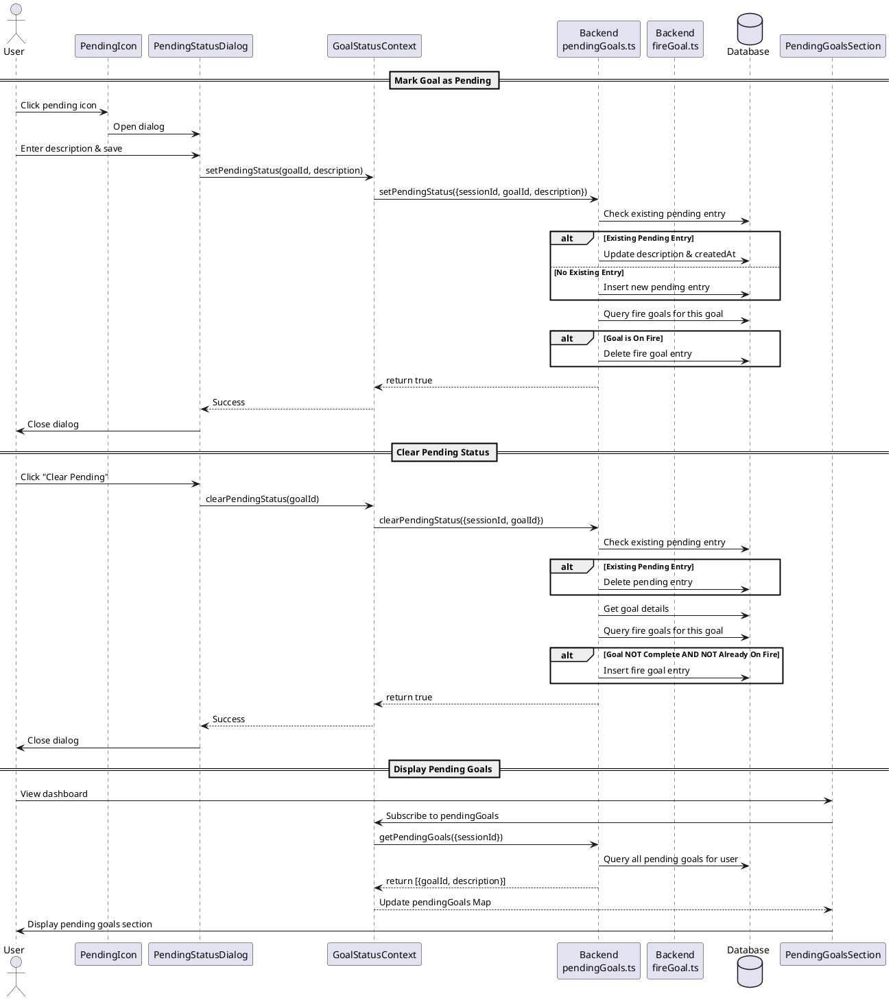

# Pending Goals Feature

## Description

The pending goals feature allows users to mark goals as "pending" when waiting for someone or something. Pending goals are visually distinguished from regular goals and grouped together in a dedicated section. The feature includes:

1. **Marking goals as pending** with a description explaining why they're pending
2. **Visual indicators** showing pending status with appropriate colors
3. **Dedicated pending section** grouping all pending goals together
4. **State management** ensuring pending goals are removed from the urgent/fire goals section
5. **Clearing pending status** returning goals to their normal state (without automatically making them urgent if they're complete)

## Current Issues

1. **Color Confusion**: Pending items use yellow (`text-yellow-500`, `bg-yellow-50`) which is too similar to fire/urgent items that also use yellow-ish tones. This creates visual confusion.
2. **Incorrect Fire Goal Behavior**: When clearing pending status on a completed goal, the backend automatically adds it to the fire goals section, which is incorrect - completed goals should not become urgent.

## Sequence Diagram



## Frontend Files

### Components - Atoms

#### PendingIcon.tsx

**Path**: `apps/webapp/src/components/atoms/PendingIcon.tsx`

**Purpose**: Displays a clickable clock icon that indicates pending status and opens the pending dialog.

**Key Functions**:

```typescript
PendingIcon(props: PendingIconProps): JSX.Element
```

**Interfaces**:

```typescript
interface PendingIconProps {
  goalId: Id<"goals">;
  className?: string;
}
```

**Current Color Issues**:

- Line 28: `text-yellow-500` - Should be changed to distinct color (e.g., `text-blue-500`)
- Line 28: `hover:text-yellow-500` - Should match new color scheme

### Components - Molecules

#### PendingStatusDialog.tsx

**Path**: `apps/webapp/src/components/molecules/goal-details/PendingStatusDialog.tsx`

**Purpose**: Dialog for setting/updating/clearing pending status with a description input.

**Key Functions**:

```typescript
PendingStatusDialog(props: PendingStatusDialogProps): JSX.Element
```

**Interfaces**:

```typescript
interface PendingStatusDialogProps {
  goalId: Id<"goals">;
  children: React.ReactNode;
}
```

**Current Color Issues**:

- Line 74: `text-yellow-500` - Should be changed to match new color scheme
- Line 100: `text-yellow-600 hover:text-yellow-700` - Should match new color scheme
- Line 111: `bg-yellow-500 hover:bg-yellow-600` - Should match new color scheme

### Components - Organisms

#### PendingGoalsSection.tsx

**Path**: `apps/webapp/src/components/organisms/focus/PendingGoalsSection.tsx`

**Purpose**: Renders the dedicated section showing all pending goals grouped by quarterly goal.

**Key Functions**:

```typescript
PendingGoalsSection(props: PendingGoalsSectionProps): JSX.Element | null
```

**Interfaces**:

```typescript
interface PendingGoalsSectionProps {
  weeklyGoalsWithQuarterly: Array<{
    weeklyGoal: GoalWithDetailsAndChildren;
    quarterlyGoal: GoalWithDetailsAndChildren;
  }>;
  selectedDayOfWeek: DayOfWeek;
  onUpdateGoalTitle: (
    goalId: Id<"goals">,
    title: string,
    details?: string
  ) => Promise<void>;
  onDeleteGoal: (goalId: Id<"goals">) => Promise<void>;
}
```

**Current Color Issues**:

- Line 172: `bg-yellow-50` - Background should be changed to match new color scheme
- Line 175: `text-yellow-500` - Icon color should be changed
- Line 176: `text-yellow-700` - Header text color should be changed
- Line 180: `text-yellow-400 hover:text-yellow-500` - Info icon colors should be changed

### Contexts

#### GoalStatusContext.tsx

**Path**: `apps/webapp/src/contexts/GoalStatusContext.tsx`

**Purpose**: Provides state management and actions for pending and fire goal status across the application.

**Key Functions**:

```typescript
useGoalStatus(): GoalStatusContextType
usePendingGoalStatus(goalId: Id<'goals'>): {
  isPending: boolean;
  pendingDescription: string | undefined;
  setPendingStatus: (description: string) => void;
  clearPendingStatus: () => void;
}
useFireGoalStatus(goalId: Id<'goals'>): {
  isOnFire: boolean;
  toggleFireStatus: () => void;
}
```

**Interfaces**:

```typescript
interface GoalStatusContextType {
  fireGoals: Set<string>;
  toggleFireStatus: (goalId: Id<"goals">) => void;
  isOnFire: (goalId: Id<"goals">) => boolean;
  pendingGoals: Map<string, string>;
  isPending: (goalId: Id<"goals">) => boolean;
  getPendingDescription: (goalId: Id<"goals">) => string | undefined;
  setPendingStatus: (goalId: Id<"goals">, description: string) => void;
  clearPendingStatus: (goalId: Id<"goals">) => void;
}

interface GoalStatusProviderProps {
  children: ReactNode;
}
```

## Backend Files

### Convex Functions

#### pendingGoals.ts

**Path**: `services/backend/convex/pendingGoals.ts`

**Purpose**: Backend mutations and queries for managing pending goal status.

**Key Functions**:

```typescript
setPendingStatus(ctx: MutationCtx, args: {
  sessionId: Id<'sessions'>;
  goalId: Id<'goals'>;
  description: string;
}): Promise<boolean>

clearPendingStatus(ctx: MutationCtx, args: {
  sessionId: Id<'sessions'>;
  goalId: Id<'goals'>;
}): Promise<boolean>

getPendingGoals(ctx: QueryCtx, args: {
  sessionId: Id<'sessions'>;
}): Promise<Array<{goalId: Id<'goals'>; description: string}>>
```

**Current Issue**:

- Lines 101-112: `clearPendingStatus` always adds goal to fire goals when cleared, even if goal is complete. Should check `goal.isComplete` before adding to fire goals.

### Database Schema

#### schema.ts

**Path**: `services/backend/convex/schema.ts`

**Purpose**: Defines database schema for goals and pending goals.

**Schema Tables**:

**goals**:

```typescript
{
  userId: Id<'users'>;
  year: number;
  quarter: number;
  title: string;
  details?: string;
  parentId?: Id<'goals'>;
  inPath: string;
  depth: number;
  carryOver?: CarryOverSchema;
  isComplete: boolean;  // ← Used to determine if goal should become urgent
  completedAt?: number;
}
```

**pendingGoals**:

```typescript
{
  userId: Id<"users">;
  goalId: Id<"goals">;
  description: string; // Why the goal is pending
  createdAt: number; // When pending status was set
}
```

**fireGoals**:

```typescript
{
  userId: Id<"users">;
  goalId: Id<"goals">;
  createdAt: number;
}
```

## Contracts

### Frontend to Backend

**Set Pending Status**:

```typescript
// Request
{
  sessionId: Id<"sessions">;
  goalId: Id<"goals">;
  description: string;
}

// Response
boolean;
```

**Clear Pending Status**:

```typescript
// Request
{
  sessionId: Id<"sessions">;
  goalId: Id<"goals">;
}

// Response
boolean;
```

**Get Pending Goals**:

```typescript
// Request
{
  sessionId: Id<"sessions">;
}

// Response
Array<{
  goalId: Id<"goals">;
  description: string;
}>;
```

## Implementation Changes Required

### Issue 1: Color Confusion

**Problem**: Yellow color used for pending items conflicts with fire/urgent items.

**Solution**: Change pending colors to blue/indigo theme which is distinct and semantically appropriate for "waiting" state.

**Files to Update**:

1. `PendingIcon.tsx` - Change yellow to blue colors
2. `PendingStatusDialog.tsx` - Change yellow to blue colors
3. `PendingGoalsSection.tsx` - Change yellow to blue theme

**Recommended Colors**:

- Icon active: `text-blue-500` (instead of `text-yellow-500`)
- Icon hover: `hover:text-blue-500` (instead of `hover:text-yellow-500`)
- Background: `bg-blue-50` with dark mode `dark:bg-blue-950/20`
- Text: `text-blue-700` with dark mode `dark:text-blue-400`
- Button: `bg-blue-500 hover:bg-blue-600` with proper dark mode variants

### Issue 2: Incorrect Fire Goal Behavior on Clear

**Problem**: When clearing pending status, backend always adds goal to fire goals, even if goal is complete.

**Solution**: Check `goal.isComplete` before adding to fire goals in `clearPendingStatus` mutation.

**File to Update**: `services/backend/convex/pendingGoals.ts`

**Change in clearPendingStatus function** (lines 101-112):

```typescript
// OLD CODE:
const existingFireGoal = await ctx.db
  .query("fireGoals")
  .withIndex("by_user_and_goal", (q) =>
    q.eq("userId", userId).eq("goalId", goalId)
  )
  .first();
if (!existingFireGoal) {
  await ctx.db.insert("fireGoals", {
    userId,
    goalId,
    createdAt: Date.now(),
  });
}

// NEW CODE:
// Only restore fire status if goal is not complete
if (!goal.isComplete) {
  const existingFireGoal = await ctx.db
    .query("fireGoals")
    .withIndex("by_user_and_goal", (q) =>
      q.eq("userId", userId).eq("goalId", goalId)
    )
    .first();
  if (!existingFireGoal) {
    await ctx.db.insert("fireGoals", {
      userId,
      goalId,
      createdAt: Date.now(),
    });
  }
}
```

## Testing Considerations

1. **Color Verification**: Verify pending items visually distinct from fire/urgent items in both light and dark modes
2. **Complete Goal Pending Clear**: Test clearing pending status on a completed goal - should not appear in urgent section
3. **Incomplete Goal Pending Clear**: Test clearing pending status on incomplete goal - should appear in urgent section
4. **Pending to Complete**: Test marking a pending goal as complete - should not move to urgent
5. **Pending Icon Visibility**: Verify icon shows properly and matches new color scheme
6. **Dialog Colors**: Verify dialog UI matches new color scheme throughout
