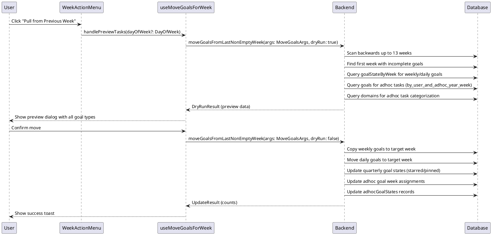

# Pull Weekly Goals with Adhoc Tasks - Codemap

## Title

Pull Goals from Last Non-Empty Week (Including Adhoc Tasks)

## Description

Enables users to pull incomplete goals from the last non-empty week (up to 13 weeks back) into the current week. This includes quarterly goals (starred/pinned status), weekly goals (with carry-over tracking), daily goals (with optional day consolidation), and adhoc tasks (with domain information). The feature provides a preview dialog showing what will be moved before committing the changes.

## Sequence Diagram



## Frontend Entry Point / Route

This feature is accessible from the weekly view:

- Weekly view: `/app/dashboard?viewMode=weekly&week=X`
  - **Search Parameters**: 
    - `viewMode=weekly` - Sets the view mode
    - `week=X` - The week number (1-53)
    - `year=YYYY` - Optional year parameter
    - `quarter=Q` - Optional quarter parameter (1-4)

The action is triggered via the `WeekActionMenu` component in the weekly view header.

## Frontend Components

### Organisms
- `apps/webapp/src/components/organisms/focus/FocusModeWeeklyView.tsx` - Weekly view container that includes the WeekActionMenu
- `apps/webapp/src/components/organisms/WeekCardPreviewDialog.tsx` - Preview dialog showing what will be moved
  - Displays quarterly goals with starred/pinned indicators
  - Displays weekly goals with carry-over week count
  - Displays daily goals grouped by quarterly and weekly goals
  - **NEW**: Displays adhoc tasks with domain badges

### Molecules
- `apps/webapp/src/components/molecules/week/WeekActionMenu.tsx` - Dropdown menu with "Pull from Previous Week" action

## Frontend Service Layer

- `apps/webapp/src/hooks/useMoveGoalsForWeek.tsx` - Hook that manages the pull goals workflow

  - **Functions**:
    ```typescript
    useMoveGoalsForWeek(props: UseMoveGoalsForWeekProps): UseMoveGoalsForWeekReturn
    
    interface UseMoveGoalsForWeekProps {
      weekNumber: number;
      year: number;
      quarter: number;
    }
    
    interface UseMoveGoalsForWeekReturn {
      isFirstWeek: boolean;
      isMovingTasks: boolean;
      handlePreviewTasks: (targetDayOfWeek?: DayOfWeek) => Promise<void>;
      dialog: ReactElement;
    }
    ```

- `apps/webapp/src/hooks/useMoveGoalsForWeekContext.tsx` - Context provider for the move goals functionality

## Backend Function Entry Point

- `services/backend/convex/goal.ts` - Contains the main mutation
  - **Functions**:
    ```typescript
    moveGoalsFromLastNonEmptyWeek(args: MoveGoalsFromLastNonEmptyWeekArgs): Promise<DryRunResult | UpdateResult>
    ```

### Contracts

```typescript
// From services/backend/src/usecase/moveGoalsFromWeek/types.ts

export type TimePeriod = {
  year: number;
  quarter: number;
  weekNumber: number;
  dayOfWeek?: DayOfWeek;
};

export type MoveGoalsFromWeekArgs = {
  userId: Id<'users'>;
  from: TimePeriod;
  to: TimePeriod;
  dryRun: boolean;
};

// NEW: Adhoc goal type for move operations
export type AdhocGoalToMove = {
  goal: Doc<'goals'>;
  domain?: Doc<'domains'>;
};

export type ProcessGoalResult = {
  weekStatesToCopy: WeekStateToCopy[];
  dailyGoalsToMove: DailyGoalToMove[];
  quarterlyGoalsToUpdate: QuarterlyGoalToUpdate[];
  adhocGoalsToMove: AdhocGoalToMove[]; // NEW
};

// Summary types for API responses
export type AdhocGoalSummary = {
  id: Id<'goals'>;
  title: string;
  domainId?: Id<'domains'>;
  domainName?: string;
  dayOfWeek?: DayOfWeek;
  dueDate?: number;
};

export type BaseGoalMoveResult = {
  weekStatesToCopy: WeekStateSummary[];
  dailyGoalsToMove: DailyGoalSummary[];
  quarterlyGoalsToUpdate: QuarterlyGoalSummary[];
  adhocGoalsToMove: AdhocGoalSummary[]; // NEW
};

export type DryRunResult = BaseGoalMoveResult & {
  isDryRun: true;
  canPull: boolean;
};

export type UpdateResult = BaseGoalMoveResult & {
  weekStatesCopied: number;
  dailyGoalsMoved: number;
  quarterlyGoalsUpdated: number;
  adhocGoalsMoved: number; // NEW
};

// Backend mutation
export const moveGoalsFromLastNonEmptyWeek = mutation({
  args: {
    sessionId: v.id('sessions'),
    to: v.object({
      year: v.number(),
      quarter: v.number(),
      weekNumber: v.number(),
      dayOfWeek: v.optional(v.union(/* DayOfWeek literals */)),
    }),
    dryRun: v.optional(v.boolean()),
  },
  handler: async (ctx, args): Promise<DryRunResult | UpdateResult> => {
    // Implementation calls moveGoalsFromLastNonEmptyWeekUsecase
  },
});
```

## Backend Usecase Layer

- `services/backend/src/usecase/moveGoalsFromWeek/moveGoalsFromWeek.ts` - Core business logic
  - **Functions**:
    ```typescript
    moveGoalsFromWeekUsecase<T extends MoveGoalsFromWeekArgs>(
      ctx: MutationCtx,
      args: T
    ): Promise<MoveGoalsFromWeekResult<T>>
    
    moveGoalsFromLastNonEmptyWeekUsecase(
      ctx: MutationCtx,
      args: MoveGoalsFromWeekArgs
    ): Promise<DryRunResult | UpdateResult>
    
    // NEW: Helper functions for adhoc goals
    getAdhocGoalsForWeek(
      ctx: MutationCtx,
      userId: Id<'users'>,
      period: TimePeriod
    ): Promise<AdhocGoalToMove[]>
    
    moveAdhocGoals(
      ctx: MutationCtx,
      userId: Id<'users'>,
      adhocGoals: AdhocGoalToMove[],
      to: TimePeriod
    ): Promise<number>
    
    generateDryRunPreview(
      weekStatesToCopy: WeekStateToCopy[],
      dailyGoalsToMove: DailyGoalToMove[],
      quarterlyGoalsToUpdate: QuarterlyGoalToUpdate[],
      adhocGoalsToMove: AdhocGoalToMove[] // NEW parameter
    ): Promise<DryRunResult>
    ```

- `services/backend/src/usecase/moveGoalsFromWeek/types.ts` - Type definitions

## Backend Schema

- `services/backend/convex/schema.ts` - Schema definitions
  - `goals` table - Main goals table
    - **Relevant fields**: `userId`, `year`, `quarter`, `title`, `details`, `parentId`, `inPath`, `depth`, `isComplete`, `adhoc`
    - **Indexes**:
      - `by_user_and_year_and_quarter` - For querying goals in a specific quarter
      - `by_user_and_year_and_quarter_and_parent` - For finding child goals
      - `by_user_and_adhoc_year_week` - **NEW**: For querying adhoc goals by week
  - `goalStateByWeek` table - Weekly goal states
    - **Relevant fields**: `userId`, `year`, `quarter`, `goalId`, `weekNumber`, `isStarred`, `isPinned`, `daily`
    - **Indexes**:
      - `by_user_and_year_and_quarter_and_week` - For finding goal states
  - `adhocGoalStates` table - **NEW**: Adhoc goal state tracking
    - **Relevant fields**: `userId`, `goalId`, `year`, `weekNumber`, `dayOfWeek`, `isComplete`
    - **Indexes**:
      - `by_user_and_goal` - For finding adhoc goal state
  - `domains` table - **NEW**: Domain categorization for adhoc goals
    - **Relevant fields**: `userId`, `name`, `description`, `color`
    - **Indexes**:
      - `by_user` - For querying user's domains

## Data Flow

### Preview Flow (Dry Run)

1. User clicks "Pull from Previous Week" in WeekActionMenu
2. Frontend calls `moveGoalsFromLastNonEmptyWeek` with `dryRun: true`
3. Backend scans backwards up to 13 weeks to find last non-empty week
4. For each candidate week:
   - Probe for existence of goal states (cheap check)
   - If found, run full dry run to check if there are movable goals
   - **NEW**: Query adhoc goals using `by_user_and_adhoc_year_week` index
   - **NEW**: Fetch domain information for adhoc goals
5. Backend returns preview data:
   - Weekly goals to copy (with carry-over count)
   - Daily goals to move (grouped by weekly/quarterly)
   - Quarterly goals to update (starred/pinned status)
   - **NEW**: Adhoc goals to move (with domain information)
6. Frontend displays preview dialog with all goal types
7. User reviews and confirms or cancels

### Commit Flow

1. User confirms in preview dialog
2. Frontend calls `moveGoalsFromLastNonEmptyWeek` with `dryRun: false`
3. Backend performs the same scan to find source week
4. Backend executes move operations:
   - Copy weekly goals to target week (create new goal records)
   - Move daily goals to target week (update goalStateByWeek records)
   - Update quarterly goal states (starred/pinned for target week)
   - **NEW**: Update adhoc goal week assignments (patch goal.adhoc.weekNumber)
   - **NEW**: Update adhocGoalStates records (patch weekNumber)
5. Backend returns counts of moved items
6. Frontend shows success toast
7. Convex query refresh updates UI

### Edge Cases

- **No Non-Empty Week**: If no week with movable content is found within 13 weeks, return `canPull: false`
- **Quarter Boundary**: Handle scanning across quarter boundaries (Q1 → Q4 of previous year)
- **Year Boundary**: Handle scanning across year boundaries (Week 1 of Y → Week 52/53 of Y-1)
- **Day Consolidation**: When pulling to a specific day, all daily goals are consolidated to that day
- **Adhoc Goals Without Domains**: Display as "Uncategorized" in preview
- **Adhoc Goals With Day Assignment**: Preserve day assignment when moving to new week

## Business Rules

1. **MUST**: Scan backwards up to 13 weeks to find last non-empty week
2. **MUST**: Only move incomplete goals (isComplete = false)
3. **MUST**: Include adhoc tasks in the move operation
4. **MUST**: Preserve domain associations for adhoc tasks
5. **MUST**: Update both goal records and state records for adhoc tasks
6. **MUST**: Show preview before committing changes
7. **MUST**: Include all goal types in preview (quarterly, weekly, daily, adhoc)
8. **MUST**: Display domain badges for adhoc tasks in preview
9. **MUST**: Return accurate counts for all moved goal types
10. **SHOULD**: Provide clear visual distinction for adhoc tasks (purple theme)
11. **SHOULD**: Show domain name in adhoc task preview items

## UI Behavior

### Preview Dialog
- Shows explanation of what will happen
- Groups goals by type (Quarterly → Weekly → Daily → Adhoc)
- Displays adhoc tasks with purple theme and domain badges
- Shows carry-over week count for weekly goals
- Shows starred/pinned indicators for quarterly goals
- Allows user to confirm or cancel

### Success State
- Shows toast: "Successfully moved tasks from last non-empty week"
- Closes preview dialog
- UI automatically updates via Convex query refresh

### Error State
- Shows error toast with specific message
- Keeps preview dialog open for retry

## Key Implementation Details

### Adhoc Goals Integration

The key fix for the reported issue was adding adhoc goals support to the move operation:

1. **Backend Changes**:
   - Added `AdhocGoalToMove` type to track adhoc goals with domain info
   - Added `adhocGoalsToMove` to `ProcessGoalResult` type
   - Added `getAdhocGoalsForWeek()` function to query incomplete adhoc goals
   - Added `moveAdhocGoals()` function to update adhoc goal week assignments
   - Updated `generateDryRunPreview()` to include adhoc goals in preview
   - Updated `moveGoalsFromWeekUsecase()` to fetch and move adhoc goals

2. **Frontend Changes**:
   - Added `adhocGoals` to preview state type
   - Added adhoc goals section to `WeekCardPreviewDialog`
   - Updated preview mapping to include adhoc goals from backend response
   - Added purple theme styling for adhoc tasks in preview

3. **Database Queries**:
   - Uses `by_user_and_adhoc_year_week` index for efficient adhoc goal lookup
   - Fetches domain information for adhoc goals to display in preview
   - Updates both `goals` table (adhoc.weekNumber) and `adhocGoalStates` table (weekNumber)

This ensures that when users pull from a previous week, adhoc tasks are properly carried over along with regular goals.

