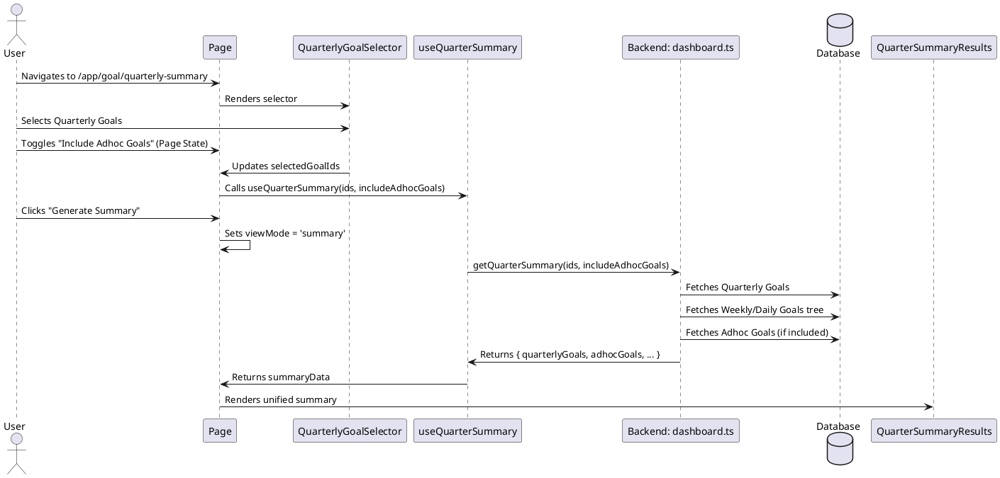

# Quarterly Summary & Adhoc Goals Integration Codemap

## Title

Quarterly Summary & Adhoc Goals Integration

## Description

Documents the implementation of the quarterly summary feature which provides a comprehensive view of goals for a specific quarter. This includes both strategic "Quarterly Goals" (and their breakdowns) and tactical "Adhoc Goals".
The architecture strictly separates the selection of different goal types while providing a unified view for the summary results.

## Sequence Diagram



## Frontend Entry Point / Route

- `apps/webapp/src/app/app/goal/quarterly-summary/page.tsx` - Main summary generation page
  - **Search Parameters**:
    - `year`: number
    - `quarter`: number
    - `goals`: comma-separated goal IDs
    - `adhoc`: boolean ('true' to include adhoc goals)

## Frontend Components

- `apps/webapp/src/components/molecules/quarterly-summary/QuarterlyGoalSelector.tsx`
  - **Responsibilities**:
    - Lists strategic *quarterly* goals for selection
    - **Scope**: Strictly limited to Quarterly Goals selection
- `apps/webapp/src/components/molecules/quarterly-summary/QuarterSummaryResults.tsx`
  - **Responsibilities**:
    - Displays the comprehensive summary
    - Renders selected Quarterly Goals (with weekly breakdowns)
    - Renders Adhoc Goals section (if included)

## Frontend Service Layer

- `apps/webapp/src/hooks/useQuarterSummary.tsx`
  - **Functions**:
    ```typescript
    useQuarterSummary(props: UseQuarterSummaryProps): UseQuarterSummaryReturn
    ```
  - **Props**:
    ```typescript
    interface UseQuarterSummaryProps {
      quarterlyGoalIds: Id<'goals'>[];
      year: number;
      quarter: number;
      includeAdhocGoals?: boolean;
    }
    ```

## Backend Function Entry Point

- `services/backend/convex/dashboard.ts`
  - **Functions**:
    ```typescript
    getQuarterSummary(args: GetQuarterSummaryArgs): Promise<MultipleQuarterlyGoalsSummary>
    ```

### Contracts

```typescript
// services/backend/src/usecase/getWeekDetails.ts
export type MultipleQuarterlyGoalsSummary = {
  quarterlyGoals: QuarterlyGoalSummary[];
  adhocGoals?: Doc<'goals'>[];
  year: number;
  quarter: number;
  weekRange: {
    startWeek: number;
    endWeek: number;
  };
};
```

## Restructuring History

- **Refactor**: Moved adhoc toggle from `QuarterlyGoalSelector` to `page.tsx` to separate concerns.
- **Refactor**: Renamed `getMultipleQuarterlyGoalsSummary` to `getQuarterSummary` to reflect broader scope.
- **Refactor**: Renamed `MultiQuarterlyGoalSummaryView` to `QuarterSummaryResults` to reflect its role as a results container for the entire quarter.
