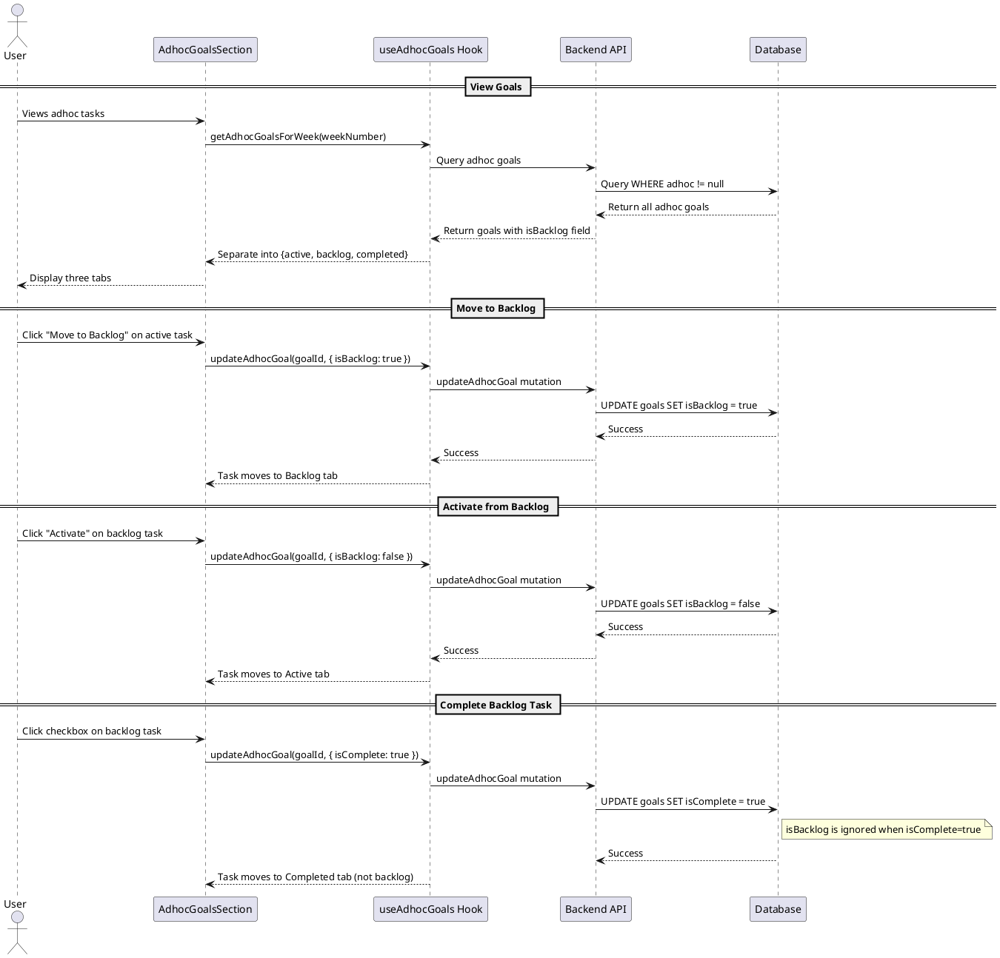

# Feature: Adhoc Goals Backlog

## Status

**Planning** - Researching and documenting implementation approach

## Goal

Add a "Backlog" tab to adhoc goals views, allowing users to move adhoc tasks to a backlog for later consideration. This helps users focus on the most important items while keeping a record of tasks they want to address in the future.

## Key Principles

1. **Completed goals are never in backlog** - Once a goal is completed, it stays in the Completed tab
2. **Backlog is distinct from Active** - Active tasks are what users focus on now; backlog tasks are deferred
3. **Easy to promote/demote** - Users can quickly move tasks between Active and Backlog

---

## Data Model

### Schema Change

Add an `isBacklog` boolean field to the `goals` table (root level, not inside `adhoc` object):

```typescript
// services/backend/convex/schema.ts
goals: defineTable({
  // ... existing fields ...

  // Backlog field for adhoc goals
  isBacklog: v.optional(v.boolean()), // true = in backlog, undefined/false = active

  // Adhoc goal fields (existing)
  adhoc: v.optional(
    v.object({
      weekNumber: v.number(),
      dueDate: v.optional(v.number()),
    })
  ),
});
```

**Why root level instead of inside `adhoc`?**

- Simpler queries and filtering
- Consistent with `isComplete` which is also at root level
- Easier to index if needed in the future

### Business Rules

1. **`isBacklog` only applies to adhoc goals** (goals where `adhoc !== undefined`)
2. **When `isComplete === true`, `isBacklog` is ignored** (completed goals are never shown in backlog)
3. **Default value is `undefined`/`false`** (new goals are active by default)
4. **When a backlog goal is completed**, it moves to Completed (not shown in backlog)

---

## System Interaction Decisions

The table below documents explicit decisions for how backlog interacts with other system features. These decisions were made based on user experience and consistency principles.

| Scenario                                   | Decision                                                                                                    | Rationale                                                                                                          |
| ------------------------------------------ | ----------------------------------------------------------------------------------------------------------- | ------------------------------------------------------------------------------------------------------------------ |
| **Pull goals from previous week**          | Backlog goals ARE pulled. Backlog status is PRESERVED.                                                      | Users want incomplete work carried forward. Backlog status should persist - user made conscious decision to defer. |
| **Pull goals from previous quarter**       | Backlog goals ARE pulled. Backlog status is PRESERVED.                                                      | Same reasoning as weekly pull. Quarter transitions shouldn't reset prioritization decisions.                       |
| **Mark backlog goal as "On Fire"**         | Goal is automatically moved to Active (`isBacklog = false`).                                                | Fire goals need immediate attention - contradicts backlog intent. Auto-activating is the logical behavior.         |
| **Mark backlog goal as "Pending"**         | Allowed. Pending status and backlog status are independent.                                                 | A deferred goal can still have external dependencies. These are orthogonal concepts.                               |
| **Clear "Pending" status on backlog goal** | Goal remains in backlog. (Note: Regular goals auto-fire when pending is cleared, but backlog goals do NOT.) | Backlog is an explicit user decision. Clearing pending shouldn't override that.                                    |
| **Create new adhoc goal**                  | Always Active (`isBacklog = false/undefined`).                                                              | New tasks need attention. Users can manually move to backlog after creation.                                       |
| **Parent goal moved to backlog**           | Children maintain independent backlog status.                                                               | Allows flexible organization. Users may want some subtasks active while parent is deferred.                        |
| **Un-complete a goal (mark incomplete)**   | Goal returns to Active (`isBacklog = false`).                                                               | Re-opening a task implies renewed attention. Fresh start in Active makes sense.                                    |
| **Delete backlog goal**                    | Normal deletion. No special behavior.                                                                       | Deletion is deletion.                                                                                              |
| **Move adhoc goal to different week**      | Backlog status is PRESERVED.                                                                                | Week assignment and prioritization are independent concepts.                                                       |
| **Domain filtering queries**               | Return all goals including backlog. Frontend filters by tab.                                                | Keep backend simple. UI handles display logic.                                                                     |
| **Nested adhoc goals (subtasks)**          | Each maintains independent backlog status.                                                                  | Maximum flexibility for task organization.                                                                         |

### Implementation Notes for Each Decision

#### 1. Pull from Previous Week (`moveGoalsFromWeek`)

**File:** `services/backend/src/usecase/moveGoalsFromWeek/moveGoalsFromWeek.ts`

The `getAdhocGoalsForWeek` function already pulls all incomplete goals. No change needed - `isBacklog` field is simply preserved during the move operation in `moveAdhocGoals`.

#### 2. Pull from Previous Quarter (`moveGoalsFromQuarter`)

**File:** `services/backend/convex/goal.ts`

The `getIncompleteAdhocGoalsForQuarter` query already returns all incomplete adhoc goals. The `moveAdhocGoalsToQuarter` mutation preserves all fields including `isBacklog`.

#### 3. Fire Goals Integration

**File:** `services/backend/convex/fireGoal.ts`

Add logic to `toggleFireStatus`: When marking a goal as fire, if the goal is a backlog adhoc goal, set `isBacklog = false`.

```typescript
// In toggleFireStatus handler, after inserting fire goal:
if (goal.adhoc && goal.isBacklog) {
  await ctx.db.patch('goals', goalId, { isBacklog: false });
}
```

#### 4. Pending Goals Integration

**File:** `services/backend/convex/pendingGoals.ts`

Modify `clearPendingStatus`: Do NOT auto-fire backlog goals when pending is cleared.

```typescript
// In clearPendingStatus handler:
// Only restore fire status if goal is not complete AND not in backlog
if (!goal.isComplete && !goal.isBacklog) {
  // ... existing fire goal logic
}
```

#### 5. Un-complete Behavior

**File:** `services/backend/convex/adhocGoal.ts`

When `isComplete` changes from `true` to `false`, reset `isBacklog`:

```typescript
// In updateAdhocGoal:
if (args.isComplete === false && goal.isComplete === true) {
  // Re-opening a completed goal - reset to active
  goalUpdates.isBacklog = false;
}
```

---

## UI Entry Points

Three main locations currently have Active/Completed tabs that need a Backlog tab:

### 1. AdhocGoalsSection (Multi-Week Grid / Weekly View)

**File:** `apps/webapp/src/components/organisms/focus/AdhocGoalsSection.tsx`

**Current UI:**

```
[Active (5)] [Completed (3)]
```

**New UI:**

```
[Active (3)] [Backlog (2)] [Completed (3)]
```

### 2. DomainPopover (Domain View Modal)

**File:** `apps/webapp/src/components/molecules/DomainPopover.tsx`

**Current UI:**

```
[Active (5)] [Completed (3)]
```

**New UI:**

```
[Active (3)] [Backlog (2)] [Completed (3)]
```

### 3. FocusModeDailyView (Daily View)

**File:** Uses `AdhocGoalsSection` component, so changes propagate automatically.

---

## Sequence Diagram



---

## Backend Changes

### 1. Schema Update

**File:** `services/backend/convex/schema.ts`

```typescript
// Add to goals table definition
isBacklog: v.optional(v.boolean()),
```

### 2. Update Adhoc Goal Mutation

**File:** `services/backend/convex/adhocGoal.ts`

Add `isBacklog` to the `updateAdhocGoal` mutation args:

```typescript
export const updateAdhocGoal = mutation({
  args: {
    ...SessionIdArg,
    goalId: v.id('goals'),
    title: v.optional(v.string()),
    details: v.optional(v.string()),
    domainId: v.optional(v.union(v.id('domains'), v.null())),
    weekNumber: v.optional(v.number()),
    dueDate: v.optional(v.number()),
    isComplete: v.optional(v.boolean()),
    isBacklog: v.optional(v.boolean()), // NEW
  },
  handler: async (ctx, args): Promise<void> => {
    // ... existing validation ...

    // Prepare goal updates
    const goalUpdates: Partial<Doc<'goals'>> = {};

    // ... existing update logic ...

    // Handle backlog status
    if (args.isBacklog !== undefined) {
      goalUpdates.isBacklog = args.isBacklog;
    }

    // Business rule: If marking as complete, clear backlog status
    if (args.isComplete === true) {
      goalUpdates.isBacklog = false;
    }

    await ctx.db.patch('goals', goalId, goalUpdates);
  },
});
```

### 3. Query Return Type Update

No changes needed to queries - the `isBacklog` field will automatically be included in returned goal documents.

---

## Frontend Changes

### 1. Hook Updates

**File:** `apps/webapp/src/hooks/useAdhocGoals.tsx`

Add `isBacklog` to the update interface:

```typescript
const updateAdhocGoal = async (
  goalId: Id<'goals'>,
  updates: {
    title?: string;
    details?: string;
    domainId?: Id<'domains'> | null;
    weekNumber?: number;
    dayOfWeek?: DayOfWeek;
    dueDate?: number;
    isComplete?: boolean;
    isBacklog?: boolean; // NEW
  }
): Promise<void> => {
  // ... existing logic ...
};
```

### 2. AdhocGoalsSection Update

**File:** `apps/webapp/src/components/organisms/focus/AdhocGoalsSection.tsx`

**Changes:**

1. Update filtering logic to separate active, backlog, and completed
2. Change tabs from 2 columns to 3 columns
3. Add backlog tab content

```typescript
// Filter goals into three categories
const activeGoals = allGoals.filter(
  (goal) => !goal.isComplete && !goal.isBacklog
);
const backlogGoals = allGoals.filter(
  (goal) => !goal.isComplete && goal.isBacklog
);
const completedGoals = allGoals.filter((goal) => goal.isComplete);

// Updated tabs
<Tabs defaultValue="active" className="w-full">
  <TabsList className="grid w-full grid-cols-3 rounded-none border-b">
    <TabsTrigger value="active" className="rounded-none">
      Active ({activeGoals.length})
    </TabsTrigger>
    <TabsTrigger value="backlog" className="rounded-none">
      Backlog ({backlogGoals.length})
    </TabsTrigger>
    <TabsTrigger value="completed" className="rounded-none">
      Completed ({completedGoals.length})
    </TabsTrigger>
  </TabsList>

  <TabsContent value="active" className="mt-3 space-y-3">
    {renderGoalsList(activeGroups, 'No active tasks')}
    {createInput}
  </TabsContent>

  <TabsContent value="backlog" className="mt-3 space-y-3">
    {renderGoalsList(backlogGroups, 'No backlog tasks')}
  </TabsContent>

  <TabsContent value="completed" className="mt-3">
    {renderGoalsList(completedGroups, 'No completed tasks')}
  </TabsContent>
</Tabs>;
```

### 3. DomainPopover Update

**File:** `apps/webapp/src/components/molecules/DomainPopover.tsx`

Apply same changes as AdhocGoalsSection:

1. Separate goals into active, backlog, completed
2. Update TabsList to 3 columns
3. Add backlog tab content

### 4. AdhocGoalItem Context Menu

**File:** `apps/webapp/src/components/molecules/AdhocGoalItem.tsx`

Add context menu options for backlog management:

```typescript
// In the dropdown menu / context menu
{
  !goal.isComplete &&
    (goal.isBacklog ? (
      <DropdownMenuItem
        onClick={() => onUpdate(goal._id, { isBacklog: false })}
      >
        <ArrowUp className="mr-2 h-4 w-4" />
        Move to Active
      </DropdownMenuItem>
    ) : (
      <DropdownMenuItem onClick={() => onUpdate(goal._id, { isBacklog: true })}>
        <Archive className="mr-2 h-4 w-4" />
        Move to Backlog
      </DropdownMenuItem>
    ));
}
```

---

## UI/UX Details

### Tab Order

```
[Active] [Backlog] [Completed]
```

**Rationale:**

- Active first (default, most used)
- Backlog in middle (deferred items)
- Completed last (historical reference)

### Visual Differentiation (Optional Enhancement)

Consider subtle visual cues for backlog items:

- Slightly muted text color
- Small "backlog" badge/icon
- Different background in list view

### Empty States

- **Active:** "No active tasks. Create one below!"
- **Backlog:** "No backlog tasks. Move tasks here for later."
- **Completed:** "No completed tasks yet."

### Goal Creation

New goals always go to **Active** tab (never created directly in backlog).

---

## Testing Checklist

### Core Functionality

- [ ] Create new adhoc task → appears in Active tab
- [ ] Move active task to backlog → appears in Backlog tab
- [ ] Move backlog task to active → appears in Active tab
- [ ] Complete active task → appears in Completed tab
- [ ] Complete backlog task → appears in Completed tab (not backlog)
- [ ] Un-complete task → appears in Active tab (resets backlog status)

### UI

- [ ] Tab counts update correctly
- [ ] All three tabs display in AdhocGoalsSection
- [ ] All three tabs display in DomainPopover
- [ ] Context menu shows correct action (Move to Backlog / Move to Active)
- [ ] Empty states show correctly in each tab

### System Interactions

- [ ] Pull from previous week: backlog goals are pulled WITH backlog status preserved
- [ ] Pull from previous quarter: backlog goals are pulled WITH backlog status preserved
- [ ] Mark backlog goal as "On Fire": goal moves to Active automatically
- [ ] Mark backlog goal as "Pending": works normally, stays in backlog
- [ ] Clear "Pending" on backlog goal: stays in backlog (does NOT auto-fire)
- [ ] Move backlog goal to different week: backlog status preserved

### Parent/Child Relationships

- [ ] Nested adhoc goals maintain backlog status independently
- [ ] Moving parent to backlog does NOT affect children's status
- [ ] Domain grouping works in backlog tab

### Dark Mode

- [ ] All tabs work correctly in dark mode
- [ ] Context menu styling in dark mode

---

## Implementation Order

### Phase 1: Backend Schema

1. Add `isBacklog` field to schema (`services/backend/convex/schema.ts`)

### Phase 2: Backend Mutations

2. Update `updateAdhocGoal` mutation to handle `isBacklog` (`services/backend/convex/adhocGoal.ts`)
3. Update `toggleFireStatus` to auto-activate backlog goals (`services/backend/convex/fireGoal.ts`)
4. Update `clearPendingStatus` to NOT auto-fire backlog goals (`services/backend/convex/pendingGoals.ts`)

### Phase 3: Frontend Hook

5. Update `useAdhocGoals` hook to accept `isBacklog` in updates (`apps/webapp/src/hooks/useAdhocGoals.tsx`)

### Phase 4: Frontend UI Components

6. Update `AdhocGoalsSection` with 3-column tabs and filtering
7. Update `DomainPopover` with 3-column tabs and filtering
8. Add context menu actions to `AdhocGoalItem`

### Phase 5: Testing & Polish

9. Test all scenarios from checklist
10. Verify dark mode styling
11. Update any affected codemaps

---

## Migration Notes

- **No data migration needed** - `isBacklog` is optional and defaults to `undefined`/`false`
- Existing goals will automatically appear in Active tab
- No breaking changes to existing API

---

## Future Enhancements (Out of Scope)

- Bulk move to backlog
- Auto-archive old backlog items
- Backlog item aging/staleness indicators
- Separate backlog by domain view
- Drag-and-drop between tabs
